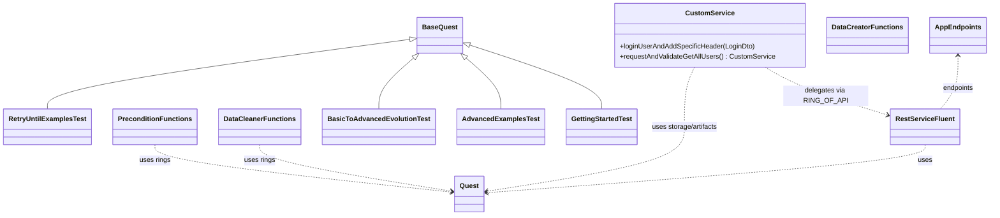
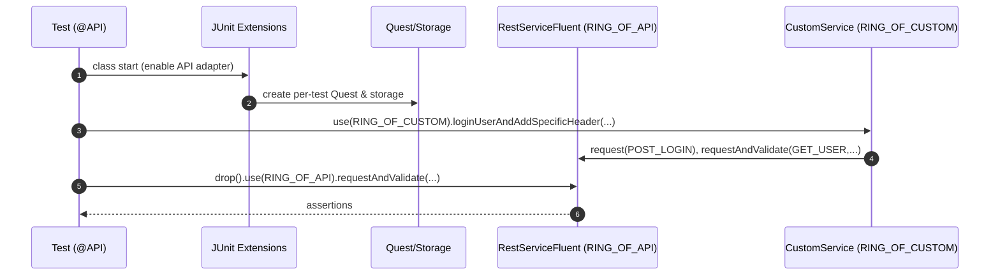

# api-test-framework

End-to-end API tests on top of ROA (Ring of Automation).

> Quick jump: if you already use ROA and just want to run the sample tests, go to  
> [Getting Started](#7-getting-started) → [Enable adapters](#74-enable-adapters-on-tests)
> and [Writing tests](#8-writing-tests-step-by-step).

---

## Table of Contents

1. [Overview](#1-overview)
2. [Core Concepts](#2-core-concepts)
    - [Quest](#21-quest)
    - [Rings](#22-rings)
    - [Storage](#23-storage)
    - [Annotations & Phases](#24-annotations--phases)
3. [Module Metadata](#3-module-metadata)
4. [Project Structure](#4-project-structure)
5. [Features & Use Cases](#5-features--use-cases)
6. [Architecture](#6-architecture)
    - [Execution Model](#61-execution-model)
    - [Test Flow](#62-test-flow)
    - [Diagrams](#63-diagrams)
    - [Bootstrap & Runtime Behavior](#64-bootstrap--runtime-behavior)
7. [Getting Started](#7-getting-started)
8. [Writing Tests (step-by-step)](#8-writing-tests-step-by-step)
9. [Storage Integration](#9-storage-integration)
10. [Custom Service & Evolution Rings](#10-custom-service--evolution-rings)
11. [Authentication, Preconditions, Cleanup](#11-authentication-preconditions-cleanup)
12. [RetryUntil](#12-retryuntil)
13. [Adapter Configuration & Reporting](#13-adapter-configuration--reporting)
14. [Troubleshooting](#14-troubleshooting)
15. [Dependencies](#15-dependencies)
16. [Author](#16-author)

---

## 1. Overview

The API Test Framework module is a focused, tutorial-style example of API automation built on the Ring of Automation (
ROA) core framework. It demonstrates how to build expressive, maintainable tests with:

- A fluent REST DSL (backed by RestAssured)
- Annotation-driven setup and preconditions
- Typed data models and JSONPath extractors
- Per-test thread-local storage
- Reusable domain flows via custom rings

It uses the public Reqres API to showcase patterns you can copy into real projects. The goal is to teach by example:
every class and test method is richly documented with Javadoc and description annotations.

### Who is this for?

- Test engineers who want readable API tests without low-level boilerplate.
- Teams adopting ROA and looking for a realistic API-only template.
- Advanced users exploring storage, journeys, custom rings, and retries.

### What you get

- A typed, fluent API façade through `RING_OF_API` (RestServiceFluent).
- Custom domain ring (`CustomService`) hiding low-level steps behind business operations.
- Evolution ring (`EvolutionService`) showing how to encapsulate complex flows.
- A set of annotations and extension points (creators, journeys, rippers, auth) ready to reuse.

---

## 2. Core Concepts

This section is a conceptual map; later sections show concrete code.

### 2.1 Quest

`Quest` is the per-test execution context from ROA. It handles:

- registered rings (API, Custom, Evolution),
- per-test thread-local storage,
- assertion aggregation (soft/hard),
- access to artifacts (e.g., raw HTTP response).

#### How you get it (JUnit 5 + ROA):

In JUnit 5 tests, the Quest is injected as a method parameter by the ROA extension when your test:
- extends BaseQuest / BaseQuestSequential, or
- is annotated with the ROA meta-annotation that enables Quest injection.

```java

@API
class MyApiTests extends BaseQuest {

   @Test
   void sample(Quest quest) {
      // use quest here
   }
}
```

How you use it:

- `quest.use(RING_OF_API)` — obtain the API fluent service
- `.drop()` — return from a fluent chain back to `Quest` to switch rings
- `.complete()` — assert all collected soft assertions and finish the chain
- `.validate(soft -> { ... })` — add soft assertions
- `.validate(() -> { ... })` — run immediate hard checks

Artifacts & storage:

- `retrieve(StorageKeysApi.API, endpoint, Response.class)` — access last stored response for an endpoint
- map to DTOs via `response.getBody().as(MyDto.class)`

Lifecycle variants:

- `BaseQuest` — per-method `Quest` lifecycle (most common)
- `BaseQuestSequential` – class-level Quest shared by all tests in the class.

### 2.2 Rings

A Ring is a named capability exposed as a fluent DSL.

This module uses:

- `RING_OF_API` — REST fluent service (built-in)
- `RING_OF_CUSTOM` — `CustomService` with reusable flows
- `RING_OF_EVOLUTION` — `EvolutionService` for encapsulated example validations

Example switching:

```java
quest
  .use(RING_OF_CUSTOM)
    .loginUserAndAddSpecificHeader(login)
  .drop()
  .use(RING_OF_API)
    .requestAndValidate(AppEndpoints.GET_ALL_USERS, /* assertions */)
  .complete();
```

### 2.3 Storage

Per-test thread-local storage is attached to `Quest`. For API, use the `StorageKeysApi.API` namespace to:

- access the last response for a given endpoint,
- pass dynamic values between steps (e.g., token, IDs),
- map bodies to DTOs and validate.

```java
GetUsersDto users =
      retrieve(StorageKeysApi.API, GET_ALL_USERS, Response.class)
            .getBody().as(GetUsersDto.class);
```

### 2.4 Annotations & Phases

Key annotations in this module:

- `@API` — enable the API adapter and inject `Quest`
- `@AuthenticateViaApi(credentials, type)` — perform API-level auth once per test
- `@Craft(model)` — inject test data generated by `DataCreator`
- `@Journey(value, journeyData, order)` — reusable preconditions run before test body
- `@Ripper(targets)` — cleanup flows after the test
- `@Regression` — marks regression scenarios
- `@Smoke` — marks smoke scenarios

Lifecycle summary:  
Hooks & capabilities → Preconditions → Data setup → Test body → Cleanup

---

## 3. Module Metadata

- name: `api-test-framework`
- groupId: `io.cyborgcode.roa.usage`
- artifactId: `api-test-framework`
- version: `1.0.0`
- parent: `io.cyborgcode.roa:roa-parent:1.1.1`

Direct dependencies (see [pom.xml](pom.xml)):

- `io.cyborgcode.roa:api-interactor-test-framework-adapter`


Profiles and defaults (from POM):

- Profiles: `dev`, `staging`, `prod` (prod active by default)
- Properties: `api.config.file`, `framework.config.file`, `test.data.file`, `logFileName`, `extended.logging`

---

## 4. Project Structure

At a high level:

- **tests**
    - [`GettingStartedTest`](src/test/java/io/cyborgcode/api/test/framework/GettingStartedTest.java)
    - [`AdvancedExamplesTest`](src/test/java/io/cyborgcode/api/test/framework/AdvancedExamplesTest.java)
    - [`BasicToAdvancedEvolutionTest`](src/test/java/io/cyborgcode/api/test/framework/BasicToAdvancedEvolutionTest.java)
    - [`RetryUntilExamplesTest`](src/test/java/io/cyborgcode/api/test/framework/RetryUntilExamplesTest.java)

- **api**
    - [`AppEndpoints`](src/main/java/io/cyborgcode/api/test/framework/api/AppEndpoints.java) — REST endpoints registry
    - `authentication/` — credentials and auth types (e.g., `AdminAuth`, `AppAuth`)
    - `dto/request/` — request DTOs (e.g., `CreateUserDto`, `LoginDto`)
    - `dto/response/` — response DTOs (`GetUsersDto`, `UserDto`, `UserData`, etc.)
    - [
      `extractors/ApiResponsesJsonPaths`](src/main/java/io/cyborgcode/api/test/framework/api/extractors/ApiResponsesJsonPaths.java) —
      JSONPath registry

- **service**
    - [`CustomService`](src/main/java/io/cyborgcode/api/test/framework/service/CustomService.java) — reusable flows
    - `EvolutionService` — example encapsulated validations

- **base**
    - [`Rings`](src/main/java/io/cyborgcode/api/test/framework/base/Rings.java) — maps logical rings to fluent
      implementations

- **data**
    - `creator/` — data builders (`DataCreator`, `DataCreatorFunctions`)
    - `cleaner/` — cleanup flows (`DataCleaner`, `DataCleanerFunctions`)
    - `constants/` — common constants (headers, paths, assertion messages)
    - `test_data/` — `Data`, `DataProperties`

- **resources**
    - `config-{dev,staging,prod}.properties`
    - `test_data-{dev,staging,prod}.properties`
    - `system.properties`

---

## 5. Features & Use Cases

### 5.1 High-level capabilities

- Fluent REST testing with soft/hard assertions
- Annotation-driven configuration and preconditions
- Per-test thread-local storage, safe for parallel runs
- Reusable domain flows via custom rings
- JSONPath extractors centralized in one place

### 5.2 Concrete module features

- `requestAndValidate(...)` with rich assertion types (status, headers, body)
- Response storage + `retrieve(...)` for chained calls
- `@Craft` and `Late<T>` for eager/lazy request models
- `@AuthenticateViaApi` for API-level authentication
- `@Journey` preconditions and `@Ripper` cleanup
- `RING_OF_CUSTOM` and `RING_OF_EVOLUTION` to slim down tests and encapsulate logic

### 5.3 Typical use cases

- Token-based flows (login → reuse header)
- Chained requests (read ID from one call, reuse in the next)
- Negative testing scenarios
- Reusable user lifecycle with setup and teardown

---

## 6. Architecture

### 6.1 Execution Model

On top of JUnit 5, the module adds four main concepts:

1. Annotations — configure capabilities, preconditions, data, cleanup
2. Test Phases — from preconditions → data → execution → cleanup
3. Storage — thread-local, per-test data passing
4. Rings — service layers for capabilities (API, custom, evolution)

### 6.2 Test Flow

1. Setup: `@API` registers the API adapter and creates a `Quest`
2. Preconditions: `@Journey` (optional) prepares data and writes to storage
3. Data crafting: `@Craft` injects DTOs (or `Late<T>` for lazy)
4. Execution: `quest.use(RING).requestAndValidate(...)`
5. Cleanup: `@Ripper` triggers cleanup flows

### 6.3 Diagrams

#### Class Diagram



#### Execution Flow



### 6.4 Bootstrap & Runtime Behavior

- `@API` enables the API adapter which:
    - creates a `Quest` per test (thread-local storage),
    - wires the REST fluent service,
    - integrates with reporting (e.g., Allure attachments),
    - processes method-level annotations before/after tests.

- Endpoints are centralized in [`AppEndpoints`](src/main/java/io/cyborgcode/api/test/framework/api/AppEndpoints.java).  
  A shared default config sets JSON content type and can add headers:

```java
public enum AppEndpoints implements Endpoint<AppEndpoints> {
   GET_ALL_USERS(Method.GET, "/users?{page}"),

   public RequestSpecification defaultConfiguration() {
      RequestSpecification spec = Endpoint.super.defaultConfiguration();
      spec.contentType(ContentType.JSON);
      spec.header(API_KEY_HEADER, API_KEY_VALUE); // example header; override/remove as needed
      return spec;
   }
}
```

---

## 7. Getting Started

### 7.1 Prerequisites

- Java (as defined by the parent POM/toolchain)
- Maven
- Internet access to reach https://reqres.in/api

### 7.2 Add dependencies (for your own module)

```xml

<dependency>
    <groupId>io.cyborgcode.roa</groupId>
    <artifactId>api-interactor-test-framework-adapter</artifactId>
</dependency>
```

### 7.3 Configure environment

The adapter uses Owner configuration. This module’s POM sets defaults and the `prod` profile is active by default. See:

- [`config-dev.properties`](src/main/resources/config-dev.properties)
- [`config-staging.properties`](src/main/resources/config-staging.properties)
- [`config-prod.properties`](src/main/resources/config-prod.properties)
- [`test_data-dev.properties`](src/main/resources/test_data-dev.properties)
- [`test_data-staging.properties`](src/main/resources/test_data-staging.properties)
- [`test_data-prod.properties`](src/main/resources/test_data-prod.properties)
- [`system.properties`](src/main/resources/system.properties) (defaults pointing to `*-prod`)

Example (`config-dev.properties`):

```properties
project.package=io.cyborgcode.api.test.framework
api.base.url=https://reqres.in/api
api.restassured.logging.enabled=true
api.restassured.logging.level=ALL
shorten.body=100000
```

#### Switching environments (profiles and overrides)

- Maven profiles (defined in this module’s `pom.xml`): `-Pdev`, `-Pstaging`, `-Pprod` (prod is default)
- Module selection (if building the multi-module repo): `-pl api-test-framework`
- System property overrides (highest precedence) can force specific files

Examples:

```bash
# Run tests with staging profile
mvn -q -pl api-test-framework -Pstaging test

# Run with dev profile
mvn -q -pl api-test-framework -Pdev test

# Run a single test and override only test data to dev
mvn -q -pl api-test-framework -Pprod \
-Dtest=GettingStartedTest#showsPostWithDtoAndSimpleBodyAssertions \
-Dtest.data.file=test_data-dev test
```

Precedence of effective config values:

1. `-D` system properties
2. Maven profile defaults
3. `system.properties`
4. Values inside the referenced property files

Common system overrides (as seen in `system.properties`):

```properties
api.config.file=config-prod
framework.config.file=config-prod
test.data.file=test_data-prod
logFileName=logs/api-example.log
extended.logging=false
```

### 7.4 Enable adapters on tests

Annotate your test class and extend `BaseQuest`:

```java

@API
class MyApiTests extends BaseQuest {
}
```

---

## 8. Writing Tests (step-by-step)

In this section we progressively evolve tests from minimal GET/POST to richer flows.

> See full examples:
> - [`GettingStartedTest`](src/test/java/io/cyborgcode/api/test/framework/GettingStartedTest.java)
> - [`AdvancedExamplesTest`](src/test/java/io/cyborgcode/api/test/framework/AdvancedExamplesTest.java)

### 8.1 Basic GET with query param

```java
quest.use(RING_OF_API)
     .requestAndValidate(
       GET_ALL_USERS.withQueryParam(PAGE_PARAM, PAGE_TWO),
       Assertion.builder().target(STATUS).type(IS).expected(SC_OK).build(),
       Assertion.builder().target(HEADER).key(CONTENT_TYPE).type(CONTAINS).expected(JSON.toString()).build()
     )
     .complete();
```

### 8.2 GET with path param and JSONPath assertion

```java
quest.use(RING_OF_API)
     .requestAndValidate(
       GET_USER.withPathParam(ID_PARAM, ID_THREE),
       Assertion.builder().target(STATUS).type(IS).expected(SC_OK).build(),
       Assertion.builder().target(BODY).key(SINGLE_USER_EMAIL_EXPLICIT.getJsonPath())
                 .type(IS).expected(USER_THREE_EMAIL).build()
     )
     .complete();
```

### 8.3 POST with DTO request body

```java
CreateUserDto createUserRequest = CreateUserDto.builder()
      .name(USER_LEADER_NAME)
      .job(USER_LEADER_JOB)
      .build();

quest.use(RING_OF_API)
     .requestAndValidate(
       POST_CREATE_USER,
       createUserRequest,
       Assertion.builder().target(STATUS).type(IS).expected(SC_CREATED).build(),
       Assertion.builder().target(BODY).key(CREATE_USER_NAME_RESPONSE.getJsonPath())
                 .type(IS).expected(USER_LEADER_NAME).build()
     )
     .complete();
```

### 8.4 Login POST + token assertion

```java
LoginDto loginRequest = LoginDto.builder()
      .email(Data.testData().username())
      .password(Data.testData().password())
      .build();

quest.use(RING_OF_API)
     .requestAndValidate(
       POST_LOGIN_USER,
       loginRequest,
       Assertion.builder().target(STATUS).type(IS).expected(SC_OK).build(),
       Assertion.builder().target(BODY).key(TOKEN.getJsonPath()).type(NOT_NULL).expected(true).build()
     )
     .complete();
```

### 8.5 Negative login (missing password)

```java
LoginDto login = LoginDto.builder()
      .email(Data.testData().username())
      .build();

quest.use(RING_OF_API)
     .requestAndValidate(
       POST_LOGIN_USER,
       login,
       Assertion.builder().target(STATUS).type(IS).expected(SC_BAD_REQUEST).build(),
       Assertion.builder().target(BODY).key(ERROR.getJsonPath())
                 .type(IS).expected(MISSING_PASSWORD_ERROR).build()
     )
     .complete();
```

---

## 9. Storage Integration

Use storage to chain requests and assert on typed DTOs.

### 9.1 Request then validate with plain JUnit

```java
quest.use(RING_OF_API)
     .request(GET_ALL_USERS.withQueryParam(PAGE_PARAM, PAGE_TWO))
     .validate(() -> {
       GetUsersDto users = retrieve(StorageKeysApi.API, GET_ALL_USERS, Response.class)
         .getBody().as(GetUsersDto.class);
       assertEquals(PAGE_TWO_DATA_SIZE, users.getData().size());
     });
```

### 9.2 Chain calls with dynamic path param from previous response

```java
quest.use(RING_OF_API)
     .request(GET_ALL_USERS.withQueryParam(PAGE_PARAM, PAGE_TWO))
     .requestAndValidate(
       GET_USER.withPathParam(
         ID_PARAM,
         retrieve(StorageKeysApi.API, GET_ALL_USERS, Response.class)
           .getBody().as(GetUsersDto.class)
           .getData().get(0).getId()
       ),
       Assertion.builder().target(STATUS).type(IS).expected(SC_OK).build()
     )
     .complete();
```

---

## 10. Custom Service & Evolution Rings

### 10.1 CustomService to slim down tests

```java
quest.use(RING_OF_CUSTOM)
     .loginUserAndAddSpecificHeader(loginAdminUser)
     .requestAndValidateGetAllUsers()
     .complete();
```

See: [`CustomService`](src/main/java/io/cyborgcode/api/test/framework/service/CustomService.java)

### 10.2 Evolution ring for encapsulated validation

```java
quest.use(RING_OF_EVOLUTION)
     .validateCreatedUser()
     .complete();
```

See: `EvolutionService` and  
[`BasicToAdvancedEvolutionTest`](src/test/java/io/cyborgcode/api/test/framework/BasicToAdvancedEvolutionTest.java)

---

## 11. Authentication, Preconditions, Cleanup

### 11.1 API-level authentication

```java
@AuthenticateViaApi(credentials = AdminAuth.class, type = AppAuth.class)
@Test
void usesApiAuth(Quest quest) {
   quest.use(RING_OF_API)
         .requestAndValidate(POST_CREATE_USER, leaderUser,
               Assertion.builder().target(STATUS).type(IS).expected(SC_CREATED).build())
         .complete();
}
```

### 11.2 Journeys as reusable preconditions

```java
@AuthenticateViaApi(credentials = AdminAuth.class, type = AppAuth.class)
@Journey(value = Preconditions.Data.CREATE_NEW_USER,
      journeyData = {@JourneyData(DataCreator.Data.USER_INTERMEDIATE)}, order = 1)
@Test
void preconditionsRunBeforeTest(Quest quest) {
   quest.use(RING_OF_API)
         .validate(() -> {
            CreatedUserDto createdUser = retrieve(StorageKeysApi.API, POST_CREATE_USER, Response.class)
                  .getBody().as(CreatedUserDto.class);
            // assertions ...
         })
         .complete();
}
```

### 11.3 Cleanup with Ripper

```java
@Ripper(targets = {DataCleaner.Data.DELETE_ADMIN_USER})
@Test
void cleanupAfterTest(Quest quest) {
   quest.use(RING_OF_API)
         .validate(() -> { /* assertions */ })
         .complete();
}
```

Full examples in:

- [`AdvancedExamplesTest`](src/test/java/io/cyborgcode/api/test/framework/AdvancedExamplesTest.java)
- [`BasicToAdvancedEvolutionTest`](src/test/java/io/cyborgcode/api/test/framework/BasicToAdvancedEvolutionTest.java)

---

## 12. RetryUntil

Poll a custom condition until it becomes true, then continue with normal calls.

```java
AtomicInteger probeCounter = new AtomicInteger(0);
RetryCondition<Boolean> condition = new RetryConditionImpl<>(
  service -> probeCounter.incrementAndGet() >= 3,
  result -> result
);

quest.use(RING_OF_API)
     .retryUntil(condition, Duration.ofSeconds(10), Duration.ofSeconds(1))
     .requestAndValidate(
       GET_ALL_USERS.withQueryParam(PAGE_PARAM, PAGE_TWO),
       Assertion.builder().target(STATUS).type(IS).expected(SC_OK).build()
     )
     .complete();
```

See: [`RetryUntilExamplesTest`](src/test/java/io/cyborgcode/api/test/framework/RetryUntilExamplesTest.java)

---

## 13. Adapter Configuration & Reporting

### 13.1 Adapter configuration

This module reuses API adapter configuration keys. Common ones in this repo:

- `api.base.url=https://reqres.in/api`
- `api.restassured.logging.enabled=true|false`
- `api.restassured.logging.level=ALL|...`
- `shorten.body=100000` (truncate large bodies in logs)

Profile defaults are set in the POM; override via `-P dev|staging|prod` or system properties.

### 13.2 Allure reporting

When Allure is on the classpath, API calls typically attach:

- request/response (URL, method, headers, body)
- status and duration
- validation target maps summarizing assertions

---

## 14. Troubleshooting

- Base URL issues — ensure `api.base.url` points to your target environment.
- JSONPath mismatches — verify paths in [`ApiResponsesJsonPaths`](src/main/java/io/cyborgcode/api/test/framework/api/extractors/ApiResponsesJsonPaths.java).
- 401/403 — when using `@AuthenticateViaApi`, confirm credentials and auth type.
- Owner config not loaded — ensure property files exist on the classpath and profile/system props are correct.
- Excessive logs — tune `api.restassured.logging.enabled` and `api.restassured.logging.level`.
- Default headers — [`AppEndpoints.defaultConfiguration()`](src/main/java/io/cyborgcode/api/test/framework/api/AppEndpoints.java) sets JSON and an example API key header; override/remove as needed for your API.

---

## 15. Dependencies

From this module’s POM:

- `io.cyborgcode.roa:api-interactor-test-framework-adapter`
- `org.projectlombok:lombok`
- `com.fasterxml.jackson.core:jackson-databind`

---

## 16. Author

**Cyborg Code Syndicate 💍👨💻**
