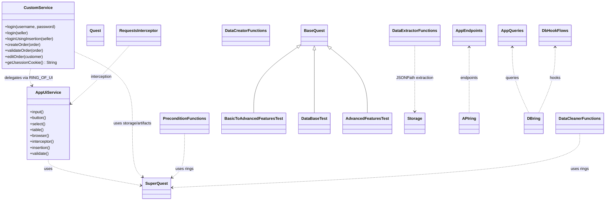
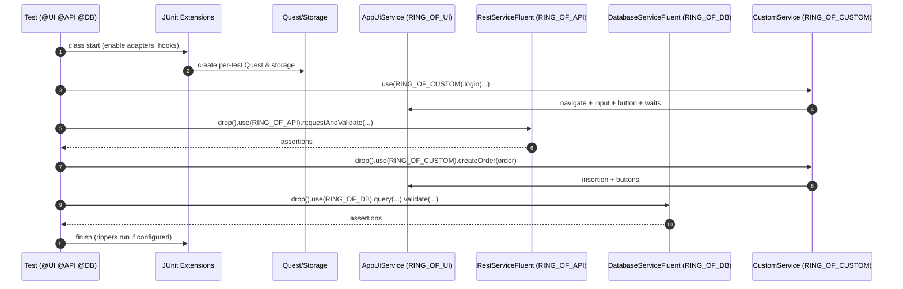

# ui-complex-test-framework

End-to-end **UI + API + DB** tests on top of ROA (Ring of Automation).

> **Quick jump:** if you already use ROA and just want to run the sample tests, go to  
> [Getting Started](#7-getting-started) → [Enable adapters](#74-enable-adapters-on-tests) and [Writing tests](#8-writing-tests-step-by-step).

---

## Table of Contents

1. [Overview](#1-overview)  
2. [Core Concepts](#2-core-concepts)  
   - [Quest](#21-quest)  
   - [Rings](#22-rings)  
   - [Storage](#23-storage)  
   - [Annotations & Phases](#24-annotations--phases)  
3. [Module Metadata](#3-module-metadata)  
4. [Project Structure](#4-project-structure)  
5. [Features & Use Cases](#5-features--use-cases)  
6. [Architecture](#6-architecture)  
   - [Execution Model](#61-execution-model)  
   - [Test Flow](#62-test-flow)  
   - [Diagrams](#63-diagrams)  
   - [Bootstrap & Runtime Behavior](#64-bootstrap--runtime-behavior)  
7. [Getting Started](#7-getting-started)  
8. [Writing Tests (step-by-step)](#8-writing-tests-step-by-step)  
9. [Storage Integration](#9-storage-integration)  
10. [UiElement Pattern & Component Services](#10-uielement-pattern--component-services)  
11. [Advanced Examples](#11-advanced-examples)  
12. [Adapter Configuration & Reporting](#12-adapter-configuration--reporting)  
13. [Troubleshooting](#13-troubleshooting)  
14. [Dependencies](#14-dependencies)  
15. [Author](#15-author)

---

## 1. Overview

The UI Complex Test Framework is a comprehensive test automation solution that combines UI, API, and database testing capabilities in a unified, annotation-driven architecture. Built on top of the Ring of Automation (ROA) core framework, it provides a structured yet flexible way to create maintainable, readable, and effective test automation suites.

This framework is designed to reduce boilerplate code, extract complex logic out of test bodies, and make tests more robust through its annotation-driven approach. It serves as live documentation for how to implement and use test automation effectively across multiple testing interfaces.

### Who is this for?

- Test engineers who want to write **readable E2E tests** without drowning in WebDriver / REST client / JDBC boilerplate.
- Developers who need a **single test DSL** that can touch UI, API and DB in one flow.
- Anyone exploring **ROA** who prefers to learn from a realistic example rather than a bare skeleton.

### What you get

- A **typed, fluent UI façade** (`AppUiService`) backed by Selenium + CDP.
- **API & DB fluent rings** with assertion support.
- A **custom domain ring** (`CustomService`) that hides low-level steps behind business operations.
- A set of **annotations and extension points** (data creators, journeys, rippers, interceptors, DB hooks) that you can copy into your own project.

---

## 2. Core Concepts

This section is a conceptual “map” of the module. Later sections show concrete code.

### 2.1 Quest

**Quest** is the per-test execution context from the core ROA framework.

It holds:

- the registered **rings** (UI, API, DB, custom),
- the **per-test storage** (thread-local),
- the **soft assertion aggregator**, and
- access to low-level **artifacts** (e.g., WebDriver, HTTP client, DB connection).

**How you get it**

In JUnit 5 tests, the `Quest` is injected as a method parameter by the ROA extension when your test:

- extends `BaseQuest` / `BaseQuestSequential`, or  
- is annotated with the ROA meta-annotation that enables Quest injection.

```java
class MyTests extends BaseQuest {

  @Test
  void sample(Quest quest) {
    // use quest here
  }
}
```

**How you use it**

- `quest.use(RING_OF_UI | RING_OF_API | RING_OF_DB | RING_OF_CUSTOM)` – obtain a fluent service for a given capability.
- `.drop()` – return from a fluent chain to `Quest` so you can switch rings.
- `.complete()` – assert all collected soft assertions and finish the chain.

Validation patterns:

- `.validate(soft -> { ... })` — add **soft assertions** collected until `.complete()`.
- `.validate(() -> { ... })` — perform an immediate **hard assertion**.

Artifacts & storage:

- `quest.artifact(RING, Type.class)` gives underlying tools (driver, client, etc.).
- Helper functions like `retrieve(...)` and `staticTestData(...)` provide type-safe reads from storage namespaces.

Lifecycle variants:

- `BaseQuest` – per-method `Quest` lifecycle (most common).
- `BaseQuestSequential` – class-level `Quest` shared by all tests in the class.

---

### 2.2 Rings

A **Ring** is a named capability (UI, API, DB, Custom…) that exposes a fluent DSL.

Out of the box this module uses:

- `RING_OF_UI` – `AppUiService` (browser UI)
- `RING_OF_API` – REST client fluent DSL
- `RING_OF_DB` – DB fluent DSL (H2/PostgreSQL/etc.)
- `RING_OF_CUSTOM` – `CustomService` (domain flows composed on top of other rings)

Example:

```java
quest
  .use(RING_OF_CUSTOM)
    .login(seller)              // uses UI under the hood
    .createOrder(order)
    .validateOrder(order)
  .drop()
  .use(RING_OF_DB)
    .query(AppQueries.QUERY_ORDER.withParam("id", 1))
    .validate(/* DB assertions */)
  .complete();
```

---

### 2.3 Storage

Each test has its own **thread-local storage** attached to `Quest`. It is used to pass data between:

- preconditions (journeys),
- fluent chains,
- hooks (DB hooks, rippers),
- interceptors, and
- the test body itself.

Typical namespaces:

- `StorageKeysUi.UI` – UI-related data (intercepted responses, dropdown options, etc.).
- `StorageKeysDb.DB` – DB query results (`QueryResponse`) keyed by query enums.
- `StorageKeysTest.PRE_ARGUMENTS` – input/output of journeys and other pre-steps.

You rarely interact with a raw map; instead you use helpers:

```java
Order order = retrieve(PRE_ARGUMENTS, DataCreator.VALID_ORDER, Order.class);

QueryResponse resp =
  retrieve(StorageKeysDb.DB, AppQueries.QUERY_ORDER, QueryResponse.class);

String username =
  retrieve(staticTestData(StaticData.USERNAME), String.class);
```

A dedicated section later ([Storage Integration](#9-storage-integration)) dives into details and best practices.

---

### 2.4 Annotations & Phases

The module relies heavily on annotations to keep tests short and self-describing.

#### Class-level

| Annotation | Phase | Purpose |
|-----------|--------|---------|
| `@UI`     | Setup  | Enable UI ring, WebDriver & CDP integration. |
| `@API`    | Setup  | Enable API ring and REST client fluent DSL. |
| `@DB`     | Setup  | Enable DB ring and query/assertion support. |
| `@DbHook(when, type, arguments, order)` | Setup / Teardown | Run DB flows (e.g., initialize H2, seed data, cleanup). |

#### Method-level

| Annotation | Phase | Purpose |
|-----------|--------|---------|
| `@Craft(model)` | Data setup | Inject models produced by `DataCreator`. Supports `Late<T>` for runtime-dependent data. |
| `@Journey(value, journeyData, order)` | Preconditions | Reusable flows (login, order creation, DB checks) that run before the test. |
| `@JourneyData(DataCreator.Data)` | Preconditions | Bind specific data creators to a journey. |
| `@AuthenticateViaUi(credentials, type, cacheCredentials)` | Preconditions | Login via UI using `AppUiLogin` + credentials class. Optional session caching. |
| `@InterceptRequests(requestUrlSubStrings)` | Execution | Enable CDP interception for matching URLs; responses stored in UI storage. |
| `@StaticTestData(Provider)` | Data setup | Load static test data into storage from a provider class. |
| `@Ripper(targets)` | Teardown | Run cleanup flows from `DataCleaner` registry. |

You can read this as a mini lifecycle:

> **Hooks & capabilities** → **Preconditions** → **Data setup** → **Test body** → **Cleanup**

---

## 3. Module Metadata

- **name:** `ui-complex-test-framework`  
- **groupId:** `io.cyborgcode.roa.usage`  
- **artifactId:** `ui-complex-test-framework`  
- **version:** `1.0.0`  
- **parent:** `io.cyborgcode.roa:roa-parent:1.1.4`  

Direct dependencies (from `pom.xml`):

- `io.cyborgcode.roa:ui-interactor-test-framework-adapter`
- `io.cyborgcode.roa:api-interactor-test-framework-adapter`
- `io.cyborgcode.roa:db-interactor-test-framework-adapter`
- `org.projectlombok:lombok`
- `com.fasterxml.jackson.core:jackson-databind`
- `com.h2database:h2`

---

## 4. Project Structure

At a high level:

- **tests**
  - `BasicToAdvancedFeaturesTest`
  - `AdvancedFeaturesTest`
  - `DataBaseTest`

- **rings**
  - `base/Rings` – map logical rings to fluent implementations.
  - `ui/AppUiService` – UI ring façade.
  - `service/CustomService` – domain-level ring (login, order flows).

- **ui**
  - `ui/elements/` – enums for fields and components (`InputFields`, `ButtonFields`, `SelectFields`, `LinkFields`, `Tables`).
  - `ui/model/` – domain models such as `Seller`, `Order` (annotated with `@InsertionElement`).
  - `ui/authentication/` – `AdminCredentials`, `AppUiLogin`.
  - `ui/interceptor/` – `RequestsInterceptor` (URL substring registry).

- **data**
  - `data/creator/` – `DataCreator`, `DataCreatorFunctions` (factories for `@Craft`).
  - `data/cleaner/` – `DataCleaner`, `DataCleanerFunctions` (cleanup logic for `@Ripper`).
  - `data/extractor/` – `DataExtractorFunctions` (JSONPath on intercepted responses).
  - `data/test_data/` – `Data`, `DataProperties`, `StaticData`.

- **db**
  - `db/hooks/` – `DbHookFlows`, `DbHookFunctions` (H2 init, custom DB flows).
  - `db/queries/` – `AppQueries` (central SQL registry).
  - `db/extractors/` – `DbResponsesJsonPaths`.

- **api**
  - `api/AppEndpoints` – REST endpoints used in examples.

---

## 5. Features & Use Cases

### 5.1 High-level capabilities

- **Multi-interface testing** – UI, REST API and DB within a single fluent chain.
- **Annotation-driven configuration** – class-level (& global) behavior defined declaratively, not in test bodies.
- **Thread-local storage** – per-test data isolation, safe for parallel execution.
- **Fluent, domain-centric DSL** – tests read like scenarios, not scripts.
- **Extensible design** – plug in your own data creators, journeys, rippers, DB hooks, custom rings.

### 5.2 Concrete module features

- **Fluent ring composition** – mix UI, API, DB and custom rings in one test.
- **Typed UI façade** – `AppUiService` exposes `input()`, `button()`, `select()`, `table()`, `browser()`, `interceptor()`, `insertion()`, `validate()`.
- **CustomService domain flows** – `login`, `createOrder`, `validateOrder`, `editOrder`, `getJsessionCookie()` etc.
- **Data crafting** – `DataCreator` factories produce strongly-typed models; `@InsertionElement` lets the framework auto-fill forms.
- **Preconditions (Journeys)** – small reusable flows that can be ordered, parameterized and share data via `PRE_ARGUMENTS`.
- **Authentication helpers** – `@AuthenticateViaUi` and `AppUiLogin` encapsulate login; optional session caching.
- **Network interception** – capture UI traffic via CDP, parse responses with JSONPath (`DataExtractorFunctions`).
- **DB integration** – DB hooks for H2 initialization, query enums + JSONPath-based assertions.
- **Cleanup (Ripper)** – `@Ripper` + `DataCleaner` ensure tests leave no residue.

### 5.3 Typical use cases

- **UI-first E2E with rich domain flows**  
  Tests focus on *intent* (“order is created and persisted”) instead of technical steps.

- **Cross-layer validation**  
  Login via UI, call a REST endpoint with the same session cookie, then assert on DB state.

- **Runtime-derived data**  
  Use intercepted responses to build `Late<T>` models (e.g., an order that uses values calculated by the backend).

- **Safe, repeatable test suites**  
  Use DB hooks and rippers so tests can be run in any order without manual cleanup.

---

## 6. Architecture

### 6.1 Execution Model

On top of JUnit 5, the module adds four main concepts:

1. **Annotations** – configure capabilities, preconditions, data, cleanup.
2. **Test Phases** – implicit flow from hooks → preconditions → data → main execution → cleanup.
3. **Storage** – thread-local, per-test way to pass data between phases and rings.
4. **Rings** – service layers for each capability (UI, API, DB, custom).

### 6.2 Test Flow

At a high level, a test runs:

1. **Setup (class level)**  
   - `@UI`, `@API`, `@DB` register adapters and create a `Quest`.
   - `@DbHook(when = BEFORE, ...)` executes DB-bootstrap flows (e.g., H2 init).

2. **Preconditions (method level)**  
   - `@Journey` and `@AuthenticateViaUi` run flows that might:
     - login,
     - create or prepare data,
     - execute DB queries or checks,
     - write results into `PRE_ARGUMENTS` storage.

3. **Data crafting**  
   - `@Craft` injects strongly-typed data models produced by `DataCreator`.
   - `@StaticTestData` preloads constants.

4. **Execution**  
   - The test body uses `quest.use(RING)` to interact with UI / API / DB / custom domain flows.
   - `.validate(...)` registers soft and hard assertions.

5. **Cleanup**  
   - `@Ripper` uses `DataCleaner` to remove created entities.
   - `@DbHook(when = AFTER, ...)` can run DB teardown if configured.

### 6.3 Diagrams

#### Class Diagram



#### Execution Flow



### 6.4 Bootstrap & Runtime Behavior

#### Test Bootstrap & Extensions

- `@UI`, `@API`, `@DB` enable JUnit 5 extensions that:
  - create a `Quest` per test (with thread-local storage),
  - wire fluent services (UI, REST, DB),
  - integrate with Allure or other reporting,
  - process method-level annotations before and after tests.

#### Fluent Service Initialization

- `AppUiService` is a typed façade on top of core UI services and is constructed with a `SmartWebDriver` and `SuperQuest`.
- It offers short-hands:
  - `.input()`, `.button()`, `.select()`, `.table()`, `.browser()`, `.interceptor()`, `.insertion()`, `.validate()`.

- `CustomService` extends the base fluent chain and:
  - delegates UI operations to `RING_OF_UI`,
  - coordinates cross-ring logic (like using a session cookie in API calls),
  - writes / reads from storage as needed.

#### Authentication with Session Caching

- `@AuthenticateViaUi(credentials = AdminCredentials.class, type = AppUiLogin.class, cacheCredentials = true)`:
  - runs the login flow via `AppUiLogin`,
  - can cache session state (cookies, local storage) to **reuse login** between tests using the same credentials.

#### Network Interception (CDP)

- `@InterceptRequests(requestUrlSubStrings = { RequestsInterceptor.Data.INTERCEPT_REQUEST_AUTH })`:
  - enables Chrome DevTools interception,
  - stores structured responses in the UI storage.
- `DataExtractorFunctions.responseBodyExtraction(...)`:
  - can strip prefixes (like `for(;;);`),
  - run JSONPath expressions,
  - return typed values that can feed `Late<T>` models or assertions.

#### Component Interaction Flow

For each interaction:

1. `before()` hook of the element enum runs (waits/synchronization).
2. The component-specific service performs the Selenium action.
3. `after()` hook runs (e.g., wait for loading, validations).
4. Optional data is stored in storage (e.g., dropdown options, table rows).

---

## 7. Getting Started

### 7.1 Prerequisites

- Java (as defined by your parent POM / toolchain).
- Maven.
- A Chromium-based browser (Chrome) + matching ChromeDriver for CDP interception.
- Application under test reachable at the URL configured in UI properties (Vaadin Bakery demo in this module).

### 7.2 Add dependencies

If you build your own module, depend on the ROA adapters:

```xml
<dependency>
  <groupId>io.cyborgcode.roa</groupId>
  <artifactId>ui-interactor-test-framework-adapter</artifactId>
</dependency>
<dependency>
  <groupId>io.cyborgcode.roa</groupId>
  <artifactId>api-interactor-test-framework-adapter</artifactId>
</dependency>
<dependency>
  <groupId>io.cyborgcode.roa</groupId>
  <artifactId>db-interactor-test-framework-adapter</artifactId>
</dependency>
```

### 7.3 Configure environment

The adapters use **Owner** configuration. This module’s POM sets defaults:

- `ui.config.file=config`
- `api.config.file=config`
- `db.config.file=config`
- `test.data.file=test_data`

Create matching files under `src/test/resources`.

**UI config** (`config.properties` or `ui.config.file` override):

```properties
ui.base.url=https://bakery-flow.demo.vaadin.com/
browser.type=CHROME
headless=false
wait.duration.in.seconds=10
project.package=io.cyborgcode.ui.complex.test.framework
```

**API config** (`config.properties` or `api.config.file`):

```properties
api.base.url=https://bakery-flow.demo.vaadin.com
api.restassured.logging.enabled=true
api.restassured.logging.level=ALL
log.full.body=false
shorten.body=800
```

**DB config** (`config.properties` or `db.config.file`):

```properties
project.package=io.cyborgcode.ui.complex.test.framework
db.default.type=H2
# For external DBs:
# db.default.host=localhost
# db.default.port=5432
# db.default.name=appdb
# db.default.username=app
# db.default.password=secret
```

**Test data** (`test_data.properties` or override):

```properties
username=admin@vaadin.com
password=admin
seller.email=admin@vaadin.com
seller.password=admin
order.customer.name=John Terry
order.customer.details=Address
order.phone.number=+1-555-7777
order.location=Store
order.product=Strawberry Bun
```

Notes:

- System properties override file values.
- You can switch config files by passing, for example: `-Dui.config.file=ui-config`.
- Adapters bring additional configuration options; see their individual READMEs for the full list.

### 7.4 Enable adapters on tests

At minimum, annotate your test class:

```java
@UI
@API
@DB
@DbHook(when = BEFORE, type = DbHookFlows.Data.INITIALIZE_H2)
class MyTests extends BaseQuest { }
```

This:

- initializes UI, API and DB rings,
- ensures the in-memory H2 DB is ready before tests.

---

## 8. Writing Tests (step-by-step)

In this section we progressively evolve tests from “raw UI steps” to a full-blown, cross-layer E2E scenario.

> You don’t have to follow these steps in order in your own project, but seeing them sequentially helps understand how the pieces fit.

### 8.1 Step 1 – First UI test (manual steps)

```java
@Test
@UI
void manualLoginAndOrder(Quest quest) {

  quest.use(RING_OF_UI)
      .browser().navigate(getUiConfig().baseUrl())
      .input().insert(InputFields.USERNAME_FIELD, "admin@vaadin.com")
      .input().insert(InputFields.PASSWORD_FIELD, "admin")
      .button().click(ButtonFields.SIGN_IN_BUTTON)
      .button().click(ButtonFields.NEW_ORDER_BUTTON)
      .input().insert(InputFields.CUSTOMER_FIELD, "John Terry")
      .select().selectOption(SelectFields.LOCATION_DDL, "Store")
      .select().selectOption(SelectFields.PRODUCTS_DDL, "Strawberry Bun")
      .button().click(ButtonFields.REVIEW_ORDER_BUTTON)
      .button().click(ButtonFields.PLACE_ORDER_BUTTON)
      .complete();
}
```

This demonstrates:

- basic **UI ring** usage,
- **element enums** for locators,
- chaining until `.complete()`.

---

### 8.2 Step 2 – Move from script to domain flows (CustomService)

Rather than keep login & order creation logic in every test, we move it into `CustomService` and expose **domain methods**:

```java
quest.use(RING_OF_CUSTOM)
    .login(seller)
    .createOrder(order)
    .validateOrder(order)
    .complete();
```

Under the hood, these methods:

- call `RING_OF_UI` fluent services,
- apply waits and assertions,
- interact with the Vaadin Bakery application in a consistent way.

---

### 8.3 Step 3 – Centralize data with `DataCreator` and `@Craft`

Instead of building `Seller` and `Order` inline, we ask `DataCreator` to produce them.

```java
@Test
void createOrderUsingCraftAndCustomService(
  Quest quest,
  @Craft(model = DataCreator.Data.VALID_SELLER) Seller seller,
  @Craft(model = DataCreator.Data.VALID_ORDER) Order order) {

  quest
    .use(RING_OF_CUSTOM)
      .login(seller)
      .createOrder(order)
      .validateOrder(order)
    .complete();
}
```

**How to add new creators**

```java
// DataCreator.java
VALID_SPECIAL_ORDER("validSpecialOrder", DataCreatorFunctions::createValidSpecialOrder);

// DataCreatorFunctions.java
public static Order createValidSpecialOrder(SuperQuest quest) {
  return Order.builder()
      .customer(Data.testData().customerName())
      .location("Bakery")
      .product("Chocolate Cake")
      .build();
}
```

---

### 8.4 Step 4 – Journeys as reusable preconditions

Journeys encapsulate reusable flows that should run **before** the test body, such as default login or preparing orders.

```java
@Journey(value = Preconditions.Data.LOGIN_DEFAULT_PRECONDITION)
@Test
void preconditionNoData(
  Quest quest,
  @Craft(model = DataCreator.Data.VALID_ORDER) Order order) {

  quest.use(RING_OF_CUSTOM)
      .createOrder(order)
      .validateOrder(order)
      .complete();
}
```

Journeys can also take data and be ordered:

```java
@Journey(
  value = Preconditions.Data.LOGIN_PRECONDITION,
  journeyData = {@JourneyData(DataCreator.Data.VALID_SELLER)},
  order = 1)
@Journey(
  value = Preconditions.Data.ORDER_PRECONDITION,
  journeyData = {@JourneyData(DataCreator.Data.VALID_ORDER)},
  order = 2)
@Test
void preconditionsOrdered(Quest quest) {

  quest.use(RING_OF_CUSTOM)
      .validateOrder(retrieve(PRE_ARGUMENTS, DataCreator.VALID_ORDER, Order.class))
      .complete();
}
```

**Adding a new journey**

```java
// Preconditions.java
SPECIAL_LOGIN_PRECONDITION("specialLoginPrecondition", PreconditionFunctions::loginUser);

// PreconditionFunctions.java
public static void loginUser(SuperQuest quest, Object... data) {
  Seller seller = (Seller) data[0];
  quest.use(RING_OF_CUSTOM).login(seller);
  // optionally store outputs into PRE_ARGUMENTS
}
```

---

### 8.5 Step 5 – Authentication via UI with `@AuthenticateViaUi`

Move login out of tests completely and treat it as a reusable “meta journey”.

```java
@AuthenticateViaUi(credentials = AdminCredentials.class, type = AppUiLogin.class)
@Test
void authNoCache(
  Quest quest,
  @Craft(model = DataCreator.Data.VALID_ORDER) Order order) {

  quest.use(RING_OF_CUSTOM)
      .createOrder(order)
      .validateOrder(order)
      .complete();
}
```

With session caching:

```java
@AuthenticateViaUi(
  credentials = AdminCredentials.class,
  type = AppUiLogin.class,
  cacheCredentials = true)
@Test
void authWithCache(
  Quest quest,
  @Craft(model = DataCreator.Data.VALID_ORDER) Order order) {

  quest.use(RING_OF_CUSTOM)
      .createOrder(order)
      .validateOrder(order)
      .complete();
}
```

This allows a suite to avoid repeated login for the same user, dramatically speeding up tests.

---

### 8.6 Step 6 – Intercept UI traffic & extract data

Enable interception with `@InterceptRequests` and then use `DataExtractorFunctions` + JSONPath to pull values out of responses:

```java
@InterceptRequests(requestUrlSubStrings = {RequestsInterceptor.Data.INTERCEPT_REQUEST_AUTH})
@Test
void extractFromTraffic(
  Quest quest,
  @Craft(model = DataCreator.Data.VALID_SELLER) Seller seller) {

  quest.use(RING_OF_CUSTOM)
      .loginUsingInsertion(seller)
    .drop()
    .use(RING_OF_UI)
      .validate(() -> Assertions.assertEquals(
        List.of("$197.54"),
        retrieve(
          DataExtractorFunctions.responseBodyExtraction(
            RequestsInterceptor.INTERCEPT_REQUEST_AUTH.getEndpointSubString(),
            "$[0].changes[?(@.key=='totalPrice')].value",
            "for(;;);"
          ),
          List.class)))
      .complete();
}
```

Key points:

- Interceptor is configured by **URL substrings**.
- Responses are stored in UI storage.
- Prefixes like `for(;;);` can be stripped before parsing.
- Extracted data can drive further steps or be asserted directly.

---

### 8.7 Step 7 – DB validations with `RING_OF_DB`

Use DB queries and JSONPath-based assertions to verify persisted state:

```java
@Test
@Journey(
  value = Preconditions.Data.LOGIN_PRECONDITION,
  journeyData = {@JourneyData(DataCreator.Data.VALID_SELLER)})
void validateStoredOrderInDb(
  Quest quest,
  @Craft(model = DataCreator.Data.VALID_ORDER) Order order) {

  quest
    .use(RING_OF_CUSTOM)
      .validateOrder(order)
    .drop()
    .use(RING_OF_DB)
      .query(AppQueries.QUERY_ORDER.withParam("id", 1))
      .validate(
        retrieve(StorageKeysDb.DB, AppQueries.QUERY_ORDER, QueryResponse.class),
        Assertion.builder()
          .target(QUERY_RESULT)
          .key(DbResponsesJsonPaths.PRODUCT_BY_ID.getJsonPath(1))
          .type(CONTAINS_ALL)
          .expected(List.of(order.getProduct()))
          .soft(true)
          .build())
    .complete();
}
```

---

### 8.8 Step 8 – Cleanup with `@Ripper` and `DataCleaner`

Ensure created orders are cleaned up after tests finish:

```java
@Test
@AuthenticateViaUi(credentials = AdminCredentials.class, type = AppUiLogin.class)
@Journey(
  value = Preconditions.Data.ORDER_PRECONDITION,
  journeyData = {@JourneyData(DataCreator.Data.VALID_ORDER)})
@Ripper(targets = {DataCleaner.Data.DELETE_CREATED_ORDERS})
void cleanupCreatedOrders(Quest quest) {

  quest
    .use(RING_OF_CUSTOM)
      .validateOrder(retrieve(PRE_ARGUMENTS, DataCreator.VALID_ORDER, Order.class))
    .complete();
}
```

Adding a new cleaner:

```java
// DataCleaner.java
DELETE_SPECIAL_RECORDS("deleteSpecial", DataCleanerFunctions::deleteSpecialRecords);

// DataCleanerFunctions.java
public static void deleteSpecialRecords(SuperQuest quest) {
  // retrieve keys from PRE_ARGUMENTS or DB, then delete via RING_OF_DB
}
```

---

## 9. Storage Integration

This section complements [2.3 Storage](#23-storage) with more detail.

### 9.1 Scope & thread-local design

- Every test has its **own storage instance** tied to its executing thread.
- When the test finishes, its storage is discarded.
- Parallel execution is safe: data from test A cannot leak into test B.

Conceptually:

```text
Test Thread 1 → Storage #1
Test Thread 2 → Storage #2
...
```

### 9.2 Namespaces & what goes where

Recommended grouping:

- **UI namespace (`StorageKeysUi.UI`)**
  - intercepted responses,
  - values read from components (e.g., dropdown options).
- **DB namespace (`StorageKeysDb.DB`)**
  - `QueryResponse` objects keyed by `AppQueries` values.
- **PRE_ARGUMENTS (`StorageKeysTest.PRE_ARGUMENTS`)**
  - input/output of journeys and preconditions (e.g., created order IDs, pre-created orders).

### 9.3 Write patterns

Many writes happen automatically (e.g., some UI services stash options, interceptors stash responses).

Manual writes:

```java
quest.getStorage().put(MyKeys.USER_ID, "user123");
```

Journeys and DB hooks often write results into `PRE_ARGUMENTS` or `DB` namespaces.

### 9.4 Read patterns

Common examples:

```java
// Journey output
Order order = retrieve(PRE_ARGUMENTS, DataCreator.VALID_ORDER, Order.class);

// Static test data
String username = retrieve(staticTestData(StaticData.USERNAME), String.class);

// DB query result for the last run of a given query
QueryResponse resp =
  retrieve(StorageKeysDb.DB, AppQueries.QUERY_ORDER, QueryResponse.class);

// Values stashed by UI services for an element
List<String> locations =
  DefaultStorage.retrieve(SelectFields.LOCATION_DDL, List.class);
```

### 9.5 Best practices

- Use **enums** as keys wherever possible for discoverability and type safety.
- Keep direct storage access inside **rings, journeys, hooks** – not scattered through tests.
- Avoid storing huge payloads unless you really need them for assertions.
- Prefer **helper methods** (`retrieve`, `staticTestData`) over raw map access to avoid casting errors.

---

## 10. UiElement Pattern & Component Services

### 10.1 UiElement enums

Element registries are enums implementing specific interfaces (`InputUiElement`, `ButtonUiElement`, etc.).

```java
public enum InputFields implements InputUiElement {

  USERNAME_FIELD(
    By.id("vaadinLoginUsername"),
    InputFieldTypes.VA_INPUT_TYPE
  ),

  PASSWORD_FIELD(
    By.id("vaadinLoginPassword"),
    InputFieldTypes.VA_INPUT_TYPE
  ),

  SEARCH_BAR_FIELD(
    By.cssSelector("search-bar#search"),
    InputFieldTypes.VA_INPUT_TYPE,
    SharedUi.WAIT_FOR_PRESENCE,
    SharedUi.WAIT_FOR_LOADING
  );

  // ... componentType(), locator(), before()/after() ...
}
```

Benefits:

- single source of truth for locators,
- per-element waits (`before`/`after`) baked into the enum values,
- type-safe usage from fluent services and insertion.

### 10.2 Mapping domain models to UI with `@InsertionElement`

Annotate your models so the framework can auto-fill forms:

```java
@Data
public class Order {

  @InsertionElement(locatorClass = InputFields.class, elementEnum = "CUSTOMER_FIELD", order = 1)
  private String customer;

  @InsertionElement(locatorClass = SelectFields.class, elementEnum = "LOCATION_DDL", order = 2)
  private String location;

  @InsertionElement(locatorClass = SelectFields.class, elementEnum = "PRODUCTS_DDL", order = 3)
  private String product;
}
```

Then use:

```java
quest.use(RING_OF_UI)
    .insertion().insertData(order);
```

### 10.3 Component services via `AppUiService`

`AppUiService` exposes typed component services so tests don’t need to think about low-level Selenium calls.

| Service        | Representative operations                                           |
|----------------|---------------------------------------------------------------------|
| `input()`      | `insert`, `clear`, `getValue`, `validateValue`                      |
| `button()`     | `click`, `validateIsVisible`, `validateIsEnabled/Hidden`           |
| `select()`     | `selectOption(s)`, `getSelectedOptions`, `getAvailableOptions`, `validateSelected` |
| `table()`      | `readTable`, `readRow` (if supported), table-level assertions       |
| `browser()`    | `navigate`, `refresh`, `back`, `forward`                            |
| `interceptor()`| access intercepted requests/responses                               |
| `insertion()`  | insert annotated models via `@InsertionElement`                     |
| `validate()`   | run custom validation lambdas as part of the chain                  |

---

## 11. Advanced Examples

This section shows focused scenarios that combine the pieces introduced above.

### 11.1 Static test data preload

Use `@StaticTestData` to load shared constants for the whole test class:

```java
@StaticTestData(StaticData.class)
@Test
void usesStaticData(Quest quest) {

  quest.use(RING_OF_CUSTOM)
      .validateOrder(retrieve(staticTestData(StaticData.ORDER), Order.class))
      .complete();
}
```

Ideal for demo data or constants you don’t want to encode in property files.

---

### 11.2 Late data creation based on intercepted responses

`Late<T>` lets you build data after some runtime information is known.

```java
@InterceptRequests(requestUrlSubStrings = {RequestsInterceptor.Data.INTERCEPT_REQUEST_AUTH})
@Test
void lateData(
  Quest quest,
  @Craft(model = DataCreator.Data.VALID_SELLER) Seller seller,
  @Craft(model = DataCreator.Data.VALID_ORDER) Order order,
  @Craft(model = DataCreator.Data.VALID_LATE_ORDER) Late<Order> lateOrder) {

  quest.use(RING_OF_CUSTOM)
      .loginUsingInsertion(seller)
      .createOrder(order).validateOrder(order)
      .createOrder(lateOrder.create()).validateOrder(lateOrder.create())
      .complete();
}
```

The `VALID_LATE_ORDER` creator can use values extracted from intercepted responses to build a second order on the fly.

---

### 11.3 Validating tables with typed rows

Map a table to a typed row class, then use fluent table operations and storage:

```java
quest
  .use(RING_OF_UI)
    .input().insert(InputFields.SEARCH_BAR_FIELD, "John Terry")
    .table().readTable(Tables.ORDERS)
    .table().validate(
      Tables.ORDERS,
      Assertion.builder()
        .target(TABLE_VALUES)
        .type(TABLE_NOT_EMPTY)
        .expected(true)
        .soft(true)
        .build())
  .complete();
```

Access the typed rows:

```java
quest
  .use(RING_OF_UI)
    .table().readTable(Tables.ORDERS)
  .drop()
  .use(RING_OF_UI)
    .validate(() -> {
      @SuppressWarnings("unchecked")
      List<TableEntry> rows =
        (List<TableEntry>) DefaultStorage.retrieve(Tables.ORDERS, List.class);
      Assertions.assertFalse(rows.isEmpty());
    })
  .complete();
```

If your adapter version supports `readRow`:

```java
TableEntry first = quest.use(RING_OF_UI).table().readRow(Tables.ORDERS, 0);
```

---

### 11.4 Full E2E: UI + API + DB + cleanup

Combine everything into a single scenario:

```java
@UI
@API
@DB
@DbHook(when = BEFORE, type = DbHookFlows.Data.INITIALIZE_H2)
@AuthenticateViaUi(
  credentials = AdminCredentials.class,
  type = AppUiLogin.class,
  cacheCredentials = true)
@Ripper(targets = {DataCleaner.Data.DELETE_CREATED_ORDERS})
@Test
void fullE2E(
  Quest quest,
  @Craft(model = DataCreator.Data.VALID_ORDER) Order order) {

  quest
    // Create via UI (Custom ring wraps UI flows)
    .use(RING_OF_CUSTOM)
      .createOrder(order)
      .validateOrder(order)
    .drop()

    // Reuse session cookie for API validation
    .use(RING_OF_API)
      .requestAndValidate(
        AppEndpoints.ENDPOINT_BAKERY.withHeader("Cookie", CustomService.getJsessionCookie()),
        Assertion.builder()
          .target(STATUS)
          .type(IS)
          .expected(HttpStatus.SC_OK)
          .build())
    .drop()

    // Validate persisted state in DB
    .use(RING_OF_DB)
      .query(AppQueries.QUERY_ORDER.withParam("id", 1))
      .validate(
        retrieve(StorageKeysDb.DB, AppQueries.QUERY_ORDER, QueryResponse.class),
        Assertion.builder()
          .target(QUERY_RESULT)
          .key(DbResponsesJsonPaths.PRODUCT_BY_ID.getJsonPath(1))
          .type(CONTAINS_ALL)
          .expected(List.of(order.getProduct()))
          .soft(true)
          .build())
    .complete();
}
```

This recipe showcases:

- multi-ring composition,
- session reuse between UI and API,
- DB verification,
- full cleanup via `@Ripper`.

---

## 12. Adapter Configuration & Reporting

### 12.1 Adapter configuration

This module does not define new Owner keys; it **reuses** configuration from:

- `ui-interactor-test-framework-adapter`,
- `api-interactor-test-framework-adapter`,
- `db-interactor-test-framework-adapter`.

Refer to their individual READMEs (under `src/main/resources/readme/...`) for:

- complete property lists,
- additional flags for logging, screenshots and retries,
- DB vendor-specific configuration.

### 12.2 Allure reporting

When Allure is on the classpath, ROA adapters typically provide:

- **UI**
  - step-level reporting for each component operation,
  - optional screenshots on pass/fail,
  - attachments for intercepted traffic when enabled.

- **API**
  - request/response attachments:
    - URL, method, headers, body, status, duration,
  - validation target maps summarizing assertions.

- **DB**
  - executed SQL snapshots and timing,
  - row samples,
  - validation target maps for DB assertions.

---

## 13. Troubleshooting

**Interception not working**

- Ensure your ChromeDriver version matches installed Chrome.
- Check that `RequestsInterceptor` URL substrings match actual network calls.
- Verify that `@InterceptRequests` is present on the test (or class).

**Authentication is flaky**

- Confirm `AppUiLogin.successfulLoginElementLocator()` points to a stable element available after login.
- Avoid depending on transient UI elements (like toasts) for login success.
- Use `cacheCredentials = true` for long-running suites.

**Elements not found**

- Double-check locators in `InputFields`, `ButtonFields`, etc.
- Make sure `SharedUi` `before`/`after` waits are suitable for your app.
- Verify that `ui.base.url` is correct and your app is reachable.

**DB assertions fail unexpectedly**

- Validate that `DbHookFlows.Data.INITIALIZE_H2` (or your hook) is actually running.
- Check that the query definition in `AppQueries` matches your schema.
- Inspect the JSONPath in `DbResponsesJsonPaths` and compare with the actual query result.

**Owner config not loaded**

- Confirm that property files exist on the test classpath.
- Check system property overrides (`ui.config.file`, `api.config.file`, `db.config.file`).
- Run with `-X` or additional logging if necessary to verify effective config values.

---

## 14. Dependencies

From this module’s POM:

- `io.cyborgcode.roa:ui-interactor-test-framework-adapter`
- `io.cyborgcode.roa:api-interactor-test-framework-adapter`
- `io.cyborgcode.roa:db-interactor-test-framework-adapter`
- `org.projectlombok:lombok`
- `com.fasterxml.jackson.core:jackson-databind`
- `com.h2database:h2`

---

## 15. Author

**Cyborg Code Syndicate 💍👨💻**

