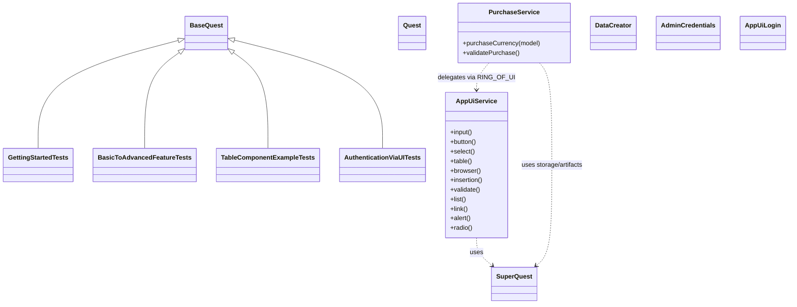

# ui-simple-test-framework

End-to-end **UI** tests on top of ROA (Ring of Automation).

> **Quick jump:** if you already use ROA and just want to run the sample tests, go to  
> [Getting Started](#7-getting-started) → [Enable adapters](#74-enable-adapters-on-tests) and [Writing Simple Component Test](#75-writing-simple-component-tests).

---

## Table of Contents

1. [Overview](#1-overview)  
2. [Core Concepts](#2-core-concepts)  
   - [Quest](#21-quest)  
   - [Rings](#22-rings)  
   - [Storage](#23-storage)  
   - [Annotations & Phases](#24-annotations--phases)  
3. [Module Metadata](#3-module-metadata)  
4. [Project Structure](#4-project-structure)  
5. [Features & Use Cases](#5-features--use-cases)  
6. [Architecture](#6-architecture)  
   - [Execution Model](#61-execution-model)  
   - [Test Flow](#62-test-flow)  
   - [Diagrams](#63-diagrams)  
   - [Bootstrap & Runtime Behavior](#64-bootstrap--runtime-behavior)  
7. [Getting Started](#7-getting-started)
   - [Prerequisites](#71-prerequisites)
   - [Add dependencies](#72-add-dependencies)
   - [Configure environment](#73-configure-environment)
   - [Enable adapters on tests](#74-enable-adapters-on-tests)
   - [Writing Simple Component Tests](#75-writing-simple-component-tests)
8. [Writing Tests (step-by-step)](#8-writing-tests-step-by-step)  
9. [Table Testing Guide](#9-table-testing-guide)  
10. [Storage Integration](#10-storage-integration)  
11. [UiElement Pattern & Component Services](#11-uielement-pattern--component-services)  
12. [Adapter Configuration & Reporting](#12-adapter-configuration--reporting)  
13. [Troubleshooting](#13-troubleshooting)  
14. [Dependencies](#14-dependencies)  
15. [Author](#15-author)

---

## 1. Overview

The UI Simple Test Framework is a focused test automation solution that demonstrates clean UI testing capabilities in a unified, annotation-driven architecture. Built on top of the Ring of Automation (ROA) core framework, it provides a structured yet flexible way to create maintainable, readable, and effective UI test automation suites.

This framework is designed to reduce boilerplate code, extract complex logic out of test bodies, and make tests more robust through its annotation-driven approach. It serves as live documentation for how to implement and use UI test automation effectively with a simple, domain-focused approach.

### Who is this for?

- Test engineers who want to write **readable UI E2E tests** without drowning in WebDriver boilerplate.
- Developers who need a **clean test DSL** that can handle UI flows with typed components.
- Anyone exploring **ROA** who prefers to learn from a realistic UI example rather than a bare skeleton.

### What you get

- A **typed, fluent UI façade** (`AppUiService`) backed by Selenium via ui-interactor.
- **Table operations** with comprehensive reading, validation, and assertion support.
- A **custom domain ring** (`PurchaseService`) that hides low-level steps behind business operations.
- A set of **annotations and extension points** (data creators, journeys, authentication) that you can copy into your own project.
- **Constants-driven test data** for maintainable and readable test assertions.

---

## 2. Core Concepts

This section is a conceptual "map" of the module. Later sections show concrete code.

### 2.1 Quest

**Quest** is the per-test execution context from the core ROA framework.

It holds:

- the registered **rings** (UI, custom),
- the **per-test storage** (thread-local),
- the **soft assertion aggregator**, and
- access to low-level **artifacts** (e.g., WebDriver).

**How you get it**

In JUnit 5 tests, the `Quest` is injected as a method parameter by the ROA extension when your test:

- extends `BaseQuest` / `BaseQuestSequential`, or  
- is annotated with the ROA meta-annotation that enables Quest injection.

```java
class MyTests extends BaseQuest {

  @Test
  void sample(Quest quest) {
    // use quest here
  }
}
```

**How you use it**

- `quest.use(RING_OF_UI | RING_OF_PURCHASE_CURRENCY)` – obtain a fluent service for a given capability.
- `.drop()` – return from a fluent chain to `Quest` so you can switch rings.
- `.complete()` – assert all collected soft assertions and finish the chain.

Validation patterns:

- `.validate(soft -> { ... })` — add **soft assertions** collected until `.complete()`.
- `.validate(() -> { ... })` — perform an immediate **hard assertion**.

Artifacts & storage:

- `quest.artifact(RING, Type.class)` gives underlying tools (driver, etc.).
- Helper functions like `retrieve(...)` provide type-safe reads from storage namespaces.

Lifecycle variants:

- `BaseQuest` – per-method `Quest` lifecycle (most common).
- `BaseQuestSequential` – class-level `Quest` shared by all tests in the class.

---

### 2.2 Rings

A **Ring** is a named capability (UI, Custom…) that exposes a fluent DSL.

Out of the box this module uses:

- `RING_OF_UI` – `AppUiService` (browser UI)
- `RING_OF_PURCHASE_CURRENCY` – `PurchaseService` (domain flows composed on top of UI ring)

Example:

```java
quest
  .use(RING_OF_PURCHASE_CURRENCY)
    .purchaseCurrency(purchaseModel)    // uses UI under the hood
    .validatePurchase()
  .drop()
  .use(RING_OF_UI)
    .table().readTable(Tables.FILTERED_TRANSACTIONS)
    .table().validate(/* table assertions */)
  .complete();
```

---

### 2.3 Storage

Each test has its own **thread-local storage** attached to `Quest`. It is used to pass data between:

- preconditions (journeys),
- fluent chains,
- the test body itself, and
- table operations.

Typical namespaces:

- `StorageKeysUi.UI` – UI-related data (table data, intercepted responses, dropdown options, etc.).
- `StorageKeysTest.PRE_ARGUMENTS` – input/output of journeys and other pre-steps.

You rarely interact with a raw map; instead you use helpers:

```java
PurchaseForeignCurrency model = retrieve(PRE_ARGUMENTS, DataCreator.PURCHASE_CURRENCY, PurchaseForeignCurrency.class);

List<FilteredTransactionEntry> tableData = 
  retrieve(StorageKeysUi.UI, Tables.FILTERED_TRANSACTIONS, List.class);
```

A dedicated section later ([Storage Integration](#10-storage-integration)) dives into details and best practices.

---

### 2.4 Annotations & Phases

The module relies heavily on annotations to keep tests short and self-describing.

#### Class-level

| Annotation | Phase | Purpose |
|-----------|--------|---------|
| `@UI`     | Setup  | Enable UI ring, WebDriver integration, and Allure hooks. |

#### Method-level

| Annotation | Phase | Purpose |
|-----------|--------|---------|
| `@Craft(model)` | Data setup | Inject models produced by `DataCreator`. |
| `@Journey(value, journeyData, order)` | Preconditions | Reusable flows (login, data setup) that run before the test. |
| `@JourneyData(DataCreator.Data)` | Preconditions | Bind specific data creators to a journey. |
| `@AuthenticateViaUi(credentials, type, cacheCredentials)` | Preconditions | Login via UI using `AppUiLogin` + credentials class. Optional session caching. |

You can read this as a mini lifecycle:

> **Capabilities** → **Preconditions** → **Data setup** → **Test body** → **Cleanup**

---

## 3. Module Metadata

- **name:** `ui-simple-test-framework`  
- **groupId:** `io.cyborgcode.roa.usage`  
- **artifactId:** `ui-simple-test-framework`  
- **version:** `1.0.0`  
- **parent:** `io.cyborgcode.roa:roa-parent:1.1.4`  

Direct dependencies (from `pom.xml`):

- `io.cyborgcode.roa:ui-interactor-test-framework-adapter`
- `org.projectlombok:lombok`

---

## 4. Project Structure

At a high level:

- **tests**
  - `GettingStartedTests` – fundamental component demonstrations
  - `BasicToAdvancedFeatureTests` – progressive feature examples
  - `TableComponentExampleTests` – comprehensive table testing scenarios
  - `AuthenticationViaUITests` – session caching and authentication examples

- **rings**
  - `base/Rings` – map logical rings to fluent implementations
  - `ui/AppUiService` – UI ring façade
  - `service/PurchaseService` – domain-level ring (purchase flows)

- **ui**
  - `ui/elements/` – enums for fields and components (`InputFields`, `ButtonFields`, `SelectFields`, `LinkFields`, `Tables`, `AlertFields`, `ListFields`, `RadioFields`)
  - `ui/model/` – domain models such as `PurchaseForeignCurrency` (annotated with `@InsertionElement`)
  - `ui/authentication/` – `AdminCredentials`, `AppUiLogin`
  - `ui/components/` – UI component type definitions
  - `ui/functions/` – utility functions for UI operations
  - `ui/types/` – type definitions for UI elements

- **data**
  - `data/creator/` – `DataCreator`, `DataCreatorFunctions` (factories for `@Craft`)
  - `data/test_data/` – `Constants`, `Data`, `DataProperties` (centralized test constants)

- **preconditions**
  - `preconditions/Preconditions` – journey definitions for reusable test preconditions
  - `preconditions/PreconditionFunctions` – implementation functions for journeys

### Constants Usage

The framework uses a centralized **Constants** class to maintain all test data in one location. This approach provides:

- **Single source of truth** for expected values, labels, and test data
- **Maintainability** when application text or values change
- **Readability** with meaningful constant names instead of magic strings
- **Reusability** across multiple test classes

Key constant categories:
- `AppLinks` – navigation and tab labels
- `TransferFunds` – account types and success messages  
- `Purchase` – currency options and purchase confirmations
- `PayBills` – payee information and payment data
- `Transactions` – transaction descriptions and date ranges
- `OnlineTransfer` – expected table data and validation values

---

## 5. Features & Use Cases

### 5.1 High-level capabilities

- **UI testing focus** – Clean, typed UI interactions within a fluent chain.
- **Annotation-driven configuration** – class-level behavior defined declaratively, not in test bodies.
- **Thread-local storage** – per-test data isolation, safe for parallel execution.
- **Fluent, domain-centric DSL** – tests read like scenarios, not scripts.
- **Extensible design** – plug in your own data creators, journeys, custom rings.

### 5.2 Concrete module features

- **Typed UI façade** – `AppUiService` exposes `input()`, `button()`, `select()`, `table()`, `browser()`, `insertion()`, `validate()`, `list()`, `link()`, `alert()`, `radio()`.
- **PurchaseService domain flows** – `purchaseCurrency`, `validatePurchase` etc.
- **Data crafting** – `DataCreator` factories produce strongly-typed models; `@InsertionElement` lets the framework auto-fill forms.
- **Insertion service** – Automatic form population through domain models using `.insertion().insertData(purchaseForeignCurrency)` for seamless data entry without manual field-by-field input.
- **Preconditions (Journeys)** – small reusable flows that can be ordered, parameterized and share data via `PRE_ARGUMENTS`.
- **Authentication helpers** – `@AuthenticateViaUi` and `AppUiLogin` encapsulate login; optional session caching.
- **Table integration** – read tables into typed models, validate with rich assertion types.
- **Constants-driven testing** – centralized test data management through `Constants` class.

### 5.3 Typical use cases

- **UI-first E2E with rich domain flows**  
  Tests focus on *intent* ("currency is purchased and validated") instead of technical steps.

- **Table data validation**  
  Read table data, validate row counts, content, uniqueness, and element states.

- **Runtime-derived data**  
  Use crafted models to build test data that varies per execution.

- **Safe, repeatable test suites**  
  Use authentication caching and journeys so tests can be run efficiently.

---

## 6. Architecture

### 6.1 Execution Model

On top of JUnit 5, the module adds four main concepts:

1. **Annotations** – configure capabilities, preconditions, data.
2. **Test Phases** – implicit flow from preconditions → data → main execution.
3. **Storage** – thread-local, per-test way to pass data between phases and rings.
4. **Rings** – service layers for each capability (UI, custom).

### 6.2 Test Flow

At a high level, a test runs:

1. **Setup (class level)**  
   - `@UI` registers UI adapter and creates a `Quest`.

2. **Preconditions (method level)**  
   - `@Journey` and `@AuthenticateViaUi` run flows that might:
     - login,
     - create or prepare data,
     - write results into `PRE_ARGUMENTS` storage.

3. **Data crafting**  
   - `@Craft` injects strongly-typed data models produced by `DataCreator`.

4. **Execution**  
   - The test body uses `quest.use(RING)` to interact with UI / custom domain flows.
   - `.validate(...)` registers soft and hard assertions.

### 6.3 Diagrams

#### Class Diagram



#### Execution Flow


### 6.4 Bootstrap & Runtime Behavior

#### Test Bootstrap & Extensions

- `@UI` enables JUnit 5 extension that:
  - creates a `Quest` per test (with thread-local storage),
  - wires fluent UI service,
  - integrates with Allure reporting,
  - processes method-level annotations before and after tests.

#### Fluent Service Initialization

- `AppUiService` is a typed façade on top of core UI services and is constructed with a `SmartWebDriver` and `SuperQuest`.
- It offers short-hands:
  - `.input()`, `.button()`, `.select()`, `.table()`, `.browser()`, `.insertion()`, `.validate()`, `.list()`, `.link()`, `.alert()`, `.radio()`.

- `PurchaseService` extends the base fluent chain and:
  - delegates UI operations to `RING_OF_UI`,
  - coordinates business logic flows,
  - writes / reads from storage as needed.

#### Authentication with Session Caching

- `@AuthenticateViaUi(credentials = AdminCredentials.class, type = AppUiLogin.class, cacheCredentials = true)`:
  - runs the login flow via `AppUiLogin`,
  - can cache session state (cookies, local storage) to **reuse login** between tests using the same credentials.

#### Component Interaction Flow

For each interaction:

1. `before()` hook of the element enum runs (waits/synchronization).
2. The component-specific service performs the Selenium action.
3. `after()` hook runs (e.g., wait for loading, validations).
4. Optional data is stored in storage (e.g., table rows).

---

## 7. Getting Started

### 7.1 Prerequisites

- Java (as defined by your parent POM / toolchain).
- Maven.
- A Chromium-based browser (Chrome) + matching ChromeDriver.
- Application under test reachable at the URL configured in UI properties (Zero Bank demo in this module).

### 7.2 Add dependencies

If you build your own module, depend on the ROA UI adapter:

```xml
<dependency>
  <groupId>io.cyborgcode.roa</groupId>
  <artifactId>ui-interactor-test-framework-adapter</artifactId>
</dependency>
```

### 7.3 Configure environment

The adapter uses **Owner** configuration. This module's defaults:

Create matching files under `src/test/resources`.

**UI config** (`ui-config.properties`):

```properties
ui.base.url=http://zero.webappsecurity.com/
browser.type=CHROME
headless=false
wait.duration.in.seconds=10
project.package=io.cyborgcode.ui.simple.test.framework
```

**Test data** (`test_data.properties`):

```properties
username=username
password=password
```

Notes:

- System properties override file values.
- You can switch config files by passing, for example: `-Dui.config.file=ui-config`.
- Adapter brings additional configuration options; see its individual README for the full list.

### 7.4 Enable adapters on tests

At minimum, annotate your test class:

```java
@UI
class MyTests extends BaseQuest { }
```

This:

- initializes UI ring,
- ensures WebDriver and fluent services are ready before tests.

### 7.5 Writing Simple Component Tests

The `GettingStartedTests` class demonstrates fundamental UI component interactions and serves as your starting point for writing tests. This section walks through a complete example that covers the most common UI operations you'll use in your tests.

#### Every UI test in this framework follows a consistent pattern:

1. **Test Setup**: Use `@Test()` annotation and inject `Quest quest` parameter
2. **Ring Activation**: Call `.use(RING_OF_UI)` to access UI component services
3. **Component Interactions**: Chain fluent method calls for UI operations
4. **Release Active Ring**: Call `.drop()` to release the current ring/service context
5. **Test Completion**: End with `.complete()`

```java
@Test()
void components_browserButtonInputLinkSelectAlert(Quest quest) {
  quest
        .use(RING_OF_UI)
        .browser().navigate(getUiConfig().baseUrl())
        .button().click(ButtonFields.SIGN_IN_BUTTON)
        .input().insert(InputFields.USERNAME_FIELD, "username")
        .input().insert(InputFields.PASSWORD_FIELD, "password")
        .button().click(ButtonFields.SIGN_IN_FORM_BUTTON)
        .browser().back()
        .link().click(LinkFields.TRANSFER_FUNDS_LINK)
        .select().selectOption(SelectFields.TF_FROM_ACCOUNT_DDL, LOAN_ACCOUNT)
        .select().selectOption(SelectFields.TF_TO_ACCOUNT_DDL, CREDIT_CARD_ACCOUNT)
        .input().insert(InputFields.AMOUNT_FIELD, "100")
        .input().insert(InputFields.TF_DESCRIPTION_FIELD, TRANSFER_LOAN_TO_CREDIT_CARD)
        .button().click(ButtonFields.SUBMIT_BUTTON)
        .button().click(ButtonFields.SUBMIT_BUTTON)
        .alert().validateValue(AlertFields.SUBMITTED_TRANSACTION, SUCCESSFUL_TRANSFER_MESSAGE)
        .drop()
        .complete();
}
```

#### Each component service provides specialized methods for different UI element types:

| Service | Purpose | Common Methods | Example Usage |
|---------|---------|----------------|---------------|
| `browser()` | Page navigation and browser controls | `navigate()`, `back()`, `refresh()` | Navigate to URLs, browser history |
| `button()` | Button interactions | `click()`, `validateIsVisible()` | Click submit buttons, verify button states |
| `input()` | Text input operations | `insert()`, `clear()`, `getValue()` | Fill forms, clear fields, read values |
| `link()` | Hyperlink interactions | `click()`, `validateText()` | Navigate via links, verify link text |
| `select()` | Dropdown selections | `selectOption()`, `getSelectedOptions()` | Choose from dropdowns, verify selections |
| `alert()` | Message validation | `validateValue()`, `validateIsVisible()` | Verify success/error messages |


#### Instead of using raw CSS selectors or XPath expressions, the framework uses enum-based element definitions:

```java
// Instead of this (brittle):
driver.findElement(By.id("user_login")).sendKeys("username");

// Use this (maintainable):
.input().insert(InputFields.USERNAME_FIELD, "username")
```

#### **Benefits of Element Enums:**
- **Compile-time safety**: Typos in element names cause build failures, not runtime errors
- **IDE support**: Auto-completion and refactoring work seamlessly
- **Centralized maintenance**: Change a locator once in the enum, update all tests
- **Built-in synchronization**: Enums can include wait strategies for dynamic elements

#### The `Constants` class centralizes test data and expected values:

```java
// From Constants.java
public static final String LOAN_ACCOUNT = "Loan";
public static final String SUCCESSFUL_TRANSFER_MESSAGE = "You successfully submitted your transaction.";
```

**Why use Constants:**
- **Single source of truth**: Change expected text in one place
- **Readable tests**: `SUCCESSFUL_TRANSFER_MESSAGE` is clearer than a raw string
- **Refactoring support**: IDE can find all usages of a constant
- **Consistency**: Same values used across multiple tests

#### Quest Lifecycle Management

1. **`.use(RING_OF_UI)`**: Activates the UI service ring, making component services available
2. **Component operations**: Chain fluent method calls for your test scenario
3. **`.drop()`**: Releases the current ring (optional but recommended for clarity)
4. **`.complete()`**: Finalizes the test, triggers cleanup, and reports results

#### Getting Started Checklist

1. ✅ **Extend `BaseQuest`**: Your test class should extend this base class
2. ✅ **Add `@UI` annotation**: Enables UI testing capabilities at the class level
3. ✅ **Inject `Quest quest`**: Add this parameter to your test method
4. ✅ **Start with `.use(RING_OF_UI)`**: Activate UI component services
5. ✅ **Use element enums**: Reference `ButtonFields`, `InputFields`, etc. instead of raw locators
6. ✅ **Use constants**: Reference `Constants` class for test data and expected values
7. ✅ **End with `.complete()`**: Always finalize your test execution


---

## 8. Writing Tests (step-by-step)

The `BasicToAdvancedFeatureTests` class demonstrates a progressive evolution from basic UI automation to advanced framework features. Each test method introduces new capabilities while building on previous concepts. Follow this learning path to understand how ROA scales from simple scripts to sophisticated, maintainable test suites.

### 8.1 Step 1 – Baseline Simple Flow (No Advanced Features)

```java
@Test
@Description("Baseline simple flow without advanced framework features")
@Regression
void baseline_simpleFlow_noAdvancedFeatures(Quest quest) {
  quest
        .use(RING_OF_UI)
        .browser().navigate("http://zero.webappsecurity.com/")
        .button().click(ButtonFields.SIGN_IN_BUTTON)
        .input().insert(InputFields.USERNAME_FIELD, "username")
        .input().insert(InputFields.PASSWORD_FIELD, "password")
        .button().click(ButtonFields.SIGN_IN_FORM_BUTTON)
        .browser().back()
        .link().click(LinkFields.TRANSFER_FUNDS_LINK)
        .list().select(ListFields.NAVIGATION_TABS, PAY_BILLS)
        .list().select(ListFields.PAY_BILLS_TABS, PURCHASE_FOREIGN_CURRENCY)
        .select().selectOption(SelectFields.PC_CURRENCY_DDL, CURRENCY_PESO)
        .input().insert(InputFields.AMOUNT_CURRENCY_FIELD, "100")
        .radio().select(RadioFields.DOLLARS_RADIO_FIELD)
        .button().click(ButtonFields.CALCULATE_COST_BUTTON)
        .button().click(ButtonFields.PURCHASE_BUTTON)
        .alert().validateValue(AlertFields.FOREIGN_CURRENCY_CASH, SUCCESSFUL_PURCHASE_MESSAGE)
        .complete();
}
```

**What this demonstrates:**
- **Basic fluent chain** with UI ring
- **Hardcoded values** ("username", "password", "100")
- **Manual navigation** and form filling
- **Element enums** for type-safe locators
- **Constants** for expected values (`CURRENCY_PESO`, `SUCCESSFUL_PURCHASE_MESSAGE`)

This is the foundation - a working test that performs a complete purchase flow but without any advanced framework features.

---

### 8.2 Step 2 – Configuration-Driven Data

```java
@Test
@Description("Retrieves Login credentials from configuration properties")
@Regression
void config_properties_retrievedLoginCredentials(Quest quest) {
  quest
        .use(RING_OF_UI)
        .browser().navigate(getUiConfig().baseUrl())
        .button().click(ButtonFields.SIGN_IN_BUTTON)
        .input().insert(InputFields.USERNAME_FIELD, Data.testData().username())
        .input().insert(InputFields.PASSWORD_FIELD, Data.testData().password())
        .button().click(ButtonFields.SIGN_IN_FORM_BUTTON)
        .browser().back()
        .link().click(LinkFields.TRANSFER_FUNDS_LINK)
        .list().select(ListFields.NAVIGATION_TABS, PAY_BILLS)
        .list().select(ListFields.PAY_BILLS_TABS, PURCHASE_FOREIGN_CURRENCY)
        .select().selectOption(SelectFields.PC_CURRENCY_DDL, CURRENCY_PESO)
        .input().insert(InputFields.AMOUNT_CURRENCY_FIELD, "100")
        .radio().select(RadioFields.DOLLARS_RADIO_FIELD)
        .button().click(ButtonFields.CALCULATE_COST_BUTTON)
        .button().click(ButtonFields.PURCHASE_BUTTON)
        .alert().validateValue(AlertFields.FOREIGN_CURRENCY_CASH, SUCCESSFUL_PURCHASE_MESSAGE)
        .complete();
}
```

**Evolution from Step 1:**
- **Configuration-driven values** instead of hardcoded strings
- `getUiConfig().baseUrl()` replaces hardcoded URL
- `Data.testData().username()` and `Data.testData().password()` read from properties
- **Environment flexibility** - same test works across environments by changing config

**Key Learning:** Externalize test data to configuration files for maintainability and environment portability.

---

### 8.3 Step 3 – Authentication via UI (No Session Caching)

```java
@Test
@Description("AuthenticateViaUi performs login per test without session caching")
@Regression
@AuthenticateViaUi(credentials = AdminCredentials.class, type = AppUiLogin.class)
void authenticateViaUi_perTestNoCache(Quest quest) {
  quest
        .use(RING_OF_UI)
        .link().click(LinkFields.TRANSFER_FUNDS_LINK)
        .list().select(ListFields.NAVIGATION_TABS, PAY_BILLS)
        .list().select(ListFields.PAY_BILLS_TABS, PURCHASE_FOREIGN_CURRENCY)
        .select().selectOption(SelectFields.PC_CURRENCY_DDL, CURRENCY_PESO)
        .input().insert(InputFields.AMOUNT_CURRENCY_FIELD, "100")
        .radio().select(RadioFields.DOLLARS_RADIO_FIELD)
        .button().click(ButtonFields.CALCULATE_COST_BUTTON)
        .button().click(ButtonFields.PURCHASE_BUTTON)
        .alert().validateValue(AlertFields.FOREIGN_CURRENCY_CASH, SUCCESSFUL_PURCHASE_MESSAGE)
        .complete();
}
```

**Evolution from Step 2:**
- **Annotation-driven authentication** - `@AuthenticateViaUi` handles login automatically
- **No manual login steps** in test body
- **Cleaner test focus** on business logic, not authentication mechanics
- **Reusable credentials** via `AdminCredentials` class

**Key Learning:** Move cross-cutting concerns like authentication out of test bodies using annotations.

---

### 8.4 Step 4 – Data Crafting with @Craft

```java
@Test
@Description("Craft injects a typed model instance for data-driven steps")
@Regression
@AuthenticateViaUi(credentials = AdminCredentials.class, type = AppUiLogin.class)
void craft_injectsModelDataIntoSteps(
      Quest quest,
      @Craft(model = DataCreator.Data.PURCHASE_CURRENCY) PurchaseForeignCurrency purchaseForeignCurrency) {
  quest
        .use(RING_OF_UI)
        .link().click(LinkFields.TRANSFER_FUNDS_LINK)
        .list().select(ListFields.NAVIGATION_TABS, PAY_BILLS)
        .list().select(ListFields.PAY_BILLS_TABS, PURCHASE_FOREIGN_CURRENCY)
        .select().selectOption(SelectFields.PC_CURRENCY_DDL, purchaseForeignCurrency.getCurrency())
        .input().insert(InputFields.AMOUNT_CURRENCY_FIELD, purchaseForeignCurrency.getAmount())
        .radio().select(RadioFields.DOLLARS_RADIO_FIELD)
        .button().click(ButtonFields.CALCULATE_COST_BUTTON)
        .button().click(ButtonFields.PURCHASE_BUTTON)
        .alert().validateValue(AlertFields.FOREIGN_CURRENCY_CASH, SUCCESSFUL_PURCHASE_MESSAGE)
        .complete();
}
```

**Evolution from Step 3:**
- **Typed data models** injected via `@Craft` annotation
- **DataCreator factories** produce consistent test data
- **Runtime data variation** - each test run can have different values
- **Type safety** - `purchaseForeignCurrency.getCurrency()` vs magic strings

**Key Learning:** Use data creators and model injection for maintainable, varied test data.

---

### 8.5 Step 5 – Insertion Service (Automatic Form Population)

```java
@Test
@Description("Insertion service maps model fields to UI controls in one operation")
@Regression
@AuthenticateViaUi(credentials = AdminCredentials.class, type = AppUiLogin.class)
void insertionService_populatesFormFromModel(Quest quest,
      @Craft(model = DataCreator.Data.PURCHASE_CURRENCY) PurchaseForeignCurrency purchaseForeignCurrency) {
  quest
        .use(RING_OF_UI)
        .link().click(LinkFields.TRANSFER_FUNDS_LINK)
        .list().select(ListFields.NAVIGATION_TABS, PAY_BILLS)
        .list().select(ListFields.PAY_BILLS_TABS, PURCHASE_FOREIGN_CURRENCY)
        .insertion().insertData(purchaseForeignCurrency)
        .button().click(ButtonFields.CALCULATE_COST_BUTTON)
        .button().click(ButtonFields.PURCHASE_BUTTON)
        .alert().validateValue(AlertFields.FOREIGN_CURRENCY_CASH, SUCCESSFUL_PURCHASE_MESSAGE)
        .complete();
}
```

**Evolution from Step 4:**
- **Automatic form filling** via `.insertion().insertData(model)`
- **@InsertionElement annotations** on model fields map to UI elements
- **Reduced boilerplate** - no manual field-by-field input
- **Maintainable mappings** - change form structure by updating annotations

**Key Learning:** Use insertion service to eliminate repetitive form-filling code and maintain field mappings declaratively.

---

### 8.6 Step 6 – Custom Service Rings (Domain-Specific Operations)

```java
@Test
@Description("Usage of custom service, and switching between different services")
@Regression
@AuthenticateViaUi(credentials = AdminCredentials.class, type = AppUiLogin.class)
void customServiceExample_switchBetweenServices(Quest quest,
      @Craft(model = DataCreator.Data.PURCHASE_CURRENCY) PurchaseForeignCurrency purchaseForeignCurrency) {
  quest
        .use(RING_OF_PURCHASE_CURRENCY)
        .purchaseCurrency(purchaseForeignCurrency)
        .drop()
        .use(RING_OF_UI)
        .alert().validateValue(AlertFields.FOREIGN_CURRENCY_CASH, SUCCESSFUL_PURCHASE_MESSAGE)
        .complete();
}
```

**Evolution from Step 5:**
- **Custom domain rings** - `RING_OF_PURCHASE_CURRENCY` provides business-focused methods
- **Service switching** - `.drop()` and `.use()` to change contexts
- **Higher abstraction** - `purchaseCurrency()` encapsulates entire UI flow
- **Business language** in tests instead of technical UI steps

**Key Learning:** Create custom rings to express business operations and hide UI implementation details.

---

### 8.7 Step 7 – Pure Domain Operations

```java
@Test
@Description("Perform the entire scenario via a custom ring (service) methods only")
@Regression
@AuthenticateViaUi(credentials = AdminCredentials.class, type = AppUiLogin.class)
void customServiceExample_usingOnlyCustomMethods(Quest quest,
      @Craft(model = DataCreator.Data.PURCHASE_CURRENCY) PurchaseForeignCurrency purchaseForeignCurrency) {
  quest
        .use(RING_OF_PURCHASE_CURRENCY)
        .purchaseCurrency(purchaseForeignCurrency)
        .validatePurchase()
        .complete();
}
```

**Evolution from Step 6:**
- **Complete abstraction** - no UI-level operations in test
- **Business-focused test** - reads like a specification
- **Reusable operations** - `purchaseCurrency()` and `validatePurchase()` can be used across tests
- **Implementation hiding** - UI changes don't affect test logic

**Key Learning:** Achieve maximum abstraction by encapsulating entire workflows in custom ring methods.

---

### 8.8 Step 8 – Reusable Preconditions (Journeys)

```java
@Test
@Description("PreQuest with a single @Journey precondition to set required state")
@Regression
@AuthenticateViaUi(credentials = AdminCredentials.class, type = AppUiLogin.class)
@Journey(value = PURCHASE_CURRENCY_PRECONDITION,
      journeyData = {@JourneyData(DataCreator.Data.PURCHASE_CURRENCY)})
void journey_singlePrecondition(Quest quest) {
  quest
        .use(RING_OF_PURCHASE_CURRENCY)
        .validatePurchase()
        .complete();
}
```

**Evolution from Step 7:**
- **Precondition automation** - `@Journey` sets up required state before test
- **Parameterized journeys** - `@JourneyData` provides data to preconditions
- **Test focus** - only validation logic remains in test body
- **Reusable setup** - journeys can be shared across multiple tests

**Key Learning:** Use journeys to extract common setup operations and focus tests on their unique validation logic.

---

## Summary of Progression

This step-by-step evolution shows how ROA transforms UI tests from:

**Basic Scripts** → **Configurable Tests** → **Annotation-Driven** → **Data-Driven** → **Domain-Focused** → **Precondition-Composed**

Each step builds on the previous, adding capabilities without losing functionality. The final tests are:
- **Highly readable** (business language)
- **Maintainable** (centralized logic)
- **Reusable** (shared components)
- **Robust** (proper abstractions)

---

## 9. Table Testing Guide

The `TableComponentExampleTests` class demonstrates comprehensive table testing capabilities in the ROA framework. This section provides practical examples for reading, validating, and interacting with tabular data in your UI tests.

### 9.1 Table Testing Overview

The framework provides powerful table operations through the `.table()` service, supporting:

- **Full table reading** - Load entire tables into typed objects
- **Selective column reading** - Read only specific columns you need
- **Row range reading** - Read subsets of rows by index range
- **Search-based row reading** - Find and read rows by criteria
- **Rich validation** - Multiple assertion types for comprehensive table validation
- **Cell-level interactions** - Insertion data or click elements within table cells

### 9.2 Complete Table Reading and Validation

The most comprehensive example shows reading an entire table and applying multiple validation types:

```java
@Test
@Description("Read entire table and validate using table assertion types")
@Regression
void readEntireTable_validateWithAssertionTypes(Quest quest) {
  quest
        .use(RING_OF_UI)
        // table(): entry point for table component interactions (read/validate/click)
        // readTable(table): reads the entire table into the framework's storage for later assertions
        .table().readTable(Tables.FILTERED_TRANSACTIONS)
        // table().validate(): fluent assertions targeting table values/elements using TableAssertionTypes
        .table().validate(
              Tables.FILTERED_TRANSACTIONS,
              Assertion.builder().target(TABLE_VALUES).type(TABLE_NOT_EMPTY).expected(true).soft(true).build(),
              Assertion.builder().target(TABLE_VALUES).type(TABLE_ROW_COUNT).expected(2).soft(true).build(),
              Assertion.builder().target(TABLE_VALUES).type(EVERY_ROW_CONTAINS_VALUES).expected(List.of(ONLINE_TRANSFER_REFERENCE)).soft(true).build(),
              Assertion.builder().target(TABLE_VALUES).type(TABLE_DOES_NOT_CONTAIN_ROW).expected(ROW_VALUES_NOT_CONTAINED).soft(true).build(),
              Assertion.builder().target(TABLE_VALUES).type(ALL_ROWS_ARE_UNIQUE).expected(true).soft(true).build(),
              Assertion.builder().target(TABLE_VALUES).type(NO_EMPTY_CELLS).expected(false).soft(true).build(),
              Assertion.builder().target(TABLE_VALUES).type(COLUMN_VALUES_ARE_UNIQUE).expected(1).soft(true).build(),
              Assertion.builder().target(TABLE_VALUES).type(TABLE_DATA_MATCHES_EXPECTED).expected(ONLINE_TRANSFERS_EXPECTED_TABLE).soft(true).build(),
              Assertion.builder().target(TABLE_ELEMENTS).type(ALL_CELLS_ENABLED).expected(true).soft(true).build(),
              Assertion.builder().target(TABLE_ELEMENTS).type(ALL_CELLS_CLICKABLE).expected(true).soft(true).build())
        // readRow(): narrows context to a single row by index for row-level assertions
        .table().readRow(Tables.FILTERED_TRANSACTIONS, 1)
        .table().validate(
              Tables.FILTERED_TRANSACTIONS,
              Assertion.builder().target(ROW_VALUES).type(ROW_NOT_EMPTY).expected(true).soft(true).build(),
              Assertion.builder().target(ROW_VALUES).type(ROW_CONTAINS_VALUES).expected(List.of(TRANSFER_DATE_1, ONLINE_TRANSFER_REFERENCE)).soft(true).build())
        .complete();
}
```

**Key Learning Points:**

- **Table Reading**: `.table().readTable(Tables.FILTERED_TRANSACTIONS)` loads the entire table
- **Multiple Validations**: Apply various assertion types in a single validation call
- **Row-Level Focus**: `.table().readRow(table, index)` for specific row validations
- **Soft Assertions**: All assertions use `.soft(true)` to collect all failures before reporting

### 9.3 Table Assertion Types

The framework provides comprehensive assertion types for different validation scenarios:

#### Content Validation
- `TABLE_NOT_EMPTY` - Ensures table has data
- `TABLE_ROW_COUNT` - Validates exact number of rows
- `NO_EMPTY_CELLS` - Checks for empty cells (expected false means empty cells are allowed)
- `TABLE_DATA_MATCHES_EXPECTED` - Compares entire table against expected data structure

#### Row and Column Validation
- `EVERY_ROW_CONTAINS_VALUES` - Ensures all rows contain specified values
- `ROW_CONTAINS_VALUES` - Validates specific row contains expected values
- `TABLE_DOES_NOT_CONTAIN_ROW` - Ensures table doesn't contain unwanted data
- `ALL_ROWS_ARE_UNIQUE` - Validates no duplicate rows
- `COLUMN_VALUES_ARE_UNIQUE` - Checks uniqueness within specific column

#### Element State Validation
- `ALL_CELLS_ENABLED` - Validates all table cells are enabled
- `ALL_CELLS_CLICKABLE` - Ensures all cells are clickable
- `ROW_NOT_EMPTY` - Validates specific row is not empty

### 9.4 Selective Column Reading

Read only the columns you need for more efficient testing:

```java
@Test
@Description("Read table with specific columns and validate target cell value")
@Regression
void readTableWithSpecifiedColumns_validateCell(Quest quest) {
  quest
        .use(RING_OF_UI)
        .button().click(ButtonFields.FIND_SUBMIT_BUTTON)
        // readTable(table, columns...): reads specific columns from the table into the framework's storage
        .table().readTable(Tables.FILTERED_TRANSACTIONS, 
              TableField.of(FilteredTransactionEntry::setDescription),
              TableField.of(FilteredTransactionEntry::setWithdrawal))
        // validate(): uses a lambda for arbitrary assertions when a built-in assertion type isn't suitable
        .validate(() -> Assertions.assertEquals(
              "50",
              retrieve(tableRowExtractor(Tables.FILTERED_TRANSACTIONS, TRANSACTION_DESCRIPTION_OFFICE_SUPPLY),
                    FilteredTransactionEntry.class).getWithdrawal().getText(),
              "Wrong deposit value")
        )
        .complete();
}
```

**Benefits of Selective Reading:**
- **Performance** - Only read data you need to validate
- **Memory efficiency** - Reduce storage footprint for large tables
- **Focused testing** - Clear intent about what data matters for the test
- **Type safety** - `TableField.of(FilteredTransactionEntry::setDescription)` provides compile-time checking

### 9.5 Row Range Reading

Read specific subsets of table rows by index range:

```java
@Test
@Description("Read table with start/end row range and validate target cell value")
@Regression
void readTableWithRowRange_validateCell(Quest quest) {
  quest
        .use(RING_OF_UI)
        .link().click(LinkFields.MY_MONEY_MAP_LINK)
        // readTable(table, start, end): reads a subset of rows (inclusive indices)
        .table().readTable(Tables.OUTFLOW, 3, 5)
        .validate(() -> Assertions.assertEquals(
              "$375.55",
              retrieve(tableRowExtractor(Tables.OUTFLOW, RETAIL),
                    OutFlow.class).getAmount().getText(),
              "Wrong Amount")
        )
        .complete();
}
```

**Use Cases for Row Range Reading:**
- **Large tables** - Focus on specific sections without loading everything
- **Pagination testing** - Validate specific pages of data
- **Performance testing** - Test with controlled data sets
- **Boundary testing** - Validate first/last rows or middle sections

### 9.6 Combined: Specific Columns with Row Range

The most targeted approach combines row range with column selection:

```java
@Test
@Description("Read specific columns within row range and validate target cell value")
@Regression
void readTableSpecificColumnsWithRowRange_validateCell(Quest quest) {
  quest
        .use(RING_OF_UI)
        .link().click(LinkFields.MY_MONEY_MAP_LINK)
        // readTable(table, start, end, columns...): subset of rows with specific mapped columns
        .table().readTable(Tables.OUTFLOW, 3, 5, 
              TableField.of(OutFlow::setCategory),
              TableField.of(OutFlow::setAmount))
        .validate(() -> Assertions.assertEquals(
              "$375.55",
              retrieve(tableRowExtractor(Tables.OUTFLOW, RETAIL),
                    OutFlow.class).getAmount().getText(),
              "Wrong Amount")
        )
        .complete();
}
```

**Maximum Efficiency**: This approach provides the most targeted data reading - only specific rows and columns.

### 9.7 Search-Based Row Reading

Find and read rows based on content criteria:

```java
@Test
@Description("Read a table row by search criteria and validate target cell value")
@Regression
void readTableRowBySearchCriteria_validateCell(Quest quest) {
  quest
        .use(RING_OF_UI)
        .link().click(LinkFields.MY_MONEY_MAP_LINK)
        // readRow(table, criteria): reads a row matching the provided search values
        .table().readRow(Tables.OUTFLOW, List.of(RETAIL))
        .validate(() -> Assertions.assertEquals(
              "$375.55",
              retrieve(tableRowExtractor(Tables.OUTFLOW),
                    OutFlow.class).getAmount().getText(),
              "Wrong Amount")
        )
        .complete();
}
```

**Search-Based Benefits:**
- **Dynamic data** - Find rows regardless of position changes
- **Content-driven** - Search by actual data values, not positions
- **Robust tests** - Tests survive table reordering or data changes
- **Business logic focus** - Find data by meaningful criteria

### 9.8 Data Retrieval Patterns

The framework provides consistent patterns for accessing table data after reading:

#### Basic Table Data Retrieval
```java
// Get all table data
List<FilteredTransactionEntry> allRows = 
  retrieve(StorageKeysUi.UI, Tables.FILTERED_TRANSACTIONS, List.class);
```

#### Search-Based Row Retrieval
```java
// Get specific row by search criteria
FilteredTransactionEntry specificRow = 
  retrieve(tableRowExtractor(Tables.FILTERED_TRANSACTIONS, TRANSACTION_DESCRIPTION_OFFICE_SUPPLY),
    FilteredTransactionEntry.class);
```

#### Direct Row Access
```java
// Get row by index (after readRow operation)
OutFlow rowData = 
  retrieve(tableRowExtractor(Tables.OUTFLOW), OutFlow.class);
```

### 9.9 Table Testing Best Practices

Based on the framework's patterns:

1. **Setup First** - Always navigate and filter before reading tables
2. **Read Then Validate** - Separate data reading from validation for clarity
3. **Use Soft Assertions** - Collect multiple failures with `.soft(true)`
4. **Choose Right Reading Method** - Match reading approach to test needs:
    - Full table: Comprehensive validation
    - Column selection: Performance optimization
    - Row range: Large table handling
    - Search criteria: Dynamic data finding
5. **Leverage Constants** - Use `Constants` class values for expected data
6. **Type Safety** - Use `TableField.of()` with method references for compile-time safety
7. **Meaningful Assertions** - Choose assertion types that match your validation intent

### 9.10 Common Table Testing Scenarios

The framework supports these typical scenarios:

- **Data Verification**: Ensure search results match expected criteria
- **Content Validation**: Verify table contains/doesn't contain specific data
- **Structure Validation**: Check row counts, uniqueness, empty cells
- **Element State Testing**: Validate clickability and enabled states
- **Performance Testing**: Use selective reading for large datasets
- **Dynamic Content**: Use search-based reading for changing data positions

---

## 10. Storage Integration

This section complements [2.3 Storage](#23-storage) with more detail on how the framework uses thread-local storage for data passing between test phases and components.

### 10.1 Scope & Thread-Local Design

- Every test has its **own storage instance** tied to its executing thread.
- When the test finishes, its storage is discarded.
- Parallel execution is safe: data from test A cannot leak into test B.

Conceptually:

```text
Test Thread 1 → Storage #1
Test Thread 2 → Storage #2
...
```

### 10.2 Namespaces & What Goes Where

Recommended grouping:

- **UI namespace (`StorageKeysUi.UI`)**
  - table data from `readTable()` operations,
  - values read from components (e.g., dropdown options).
- **PRE_ARGUMENTS (`StorageKeysTest.PRE_ARGUMENTS`)**
  - input/output of journeys and preconditions (e.g., created data, pre-setup state).

### 10.3 Write Patterns

Many writes happen automatically (e.g., table services stash table data).

Manual writes:

```java
quest.getStorage().put(MyKeys.USER_ID, "user123");
```

Journeys often write results into `PRE_ARGUMENTS` namespace.

### 10.4 Read Patterns

Common examples:

```java
// Journey output
PurchaseForeignCurrency model = retrieve(PRE_ARGUMENTS, DataCreator.PURCHASE_CURRENCY, PurchaseForeignCurrency.class);

// Table data for the last read of a given table
List<FilteredTransactionEntry> tableData =
  retrieve(StorageKeysUi.UI, Tables.FILTERED_TRANSACTIONS, List.class);
```

### 10.5 Best Practices

- **Use enums as keys** wherever possible for discoverability and type safety.
- **Keep direct storage access inside rings, journeys** – not scattered through tests.
- **Avoid storing huge payloads** unless you really need them for assertions.
- **Prefer helper methods** (`retrieve`, `Data.testData()`) over raw map access to avoid casting errors.
- **Document storage contracts** when creating custom rings that depend on specific stored data.

---

## 11. UiElement Pattern & Component Services

### 11.1 UiElement enums

Element registries are enums implementing specific interfaces (e.g., `ButtonUiElement`) that encode the locator, component type, and synchronization strategy for each control. Using `ButtonFields` as an example (see `ButtonFields.java`), each constant defines a `By` locator, a `ButtonComponentType` via `ButtonFieldTypes`, and optional `before/after` hooks for robust timing. This keeps synchronization close to the element and avoids repeating waits across tests.

```java
public enum ButtonFields implements ButtonUiElement {
  SIGN_IN_BUTTON(By.tagName("vaadin-button"), ButtonFieldTypes.VA_BUTTON_TYPE,
      SharedUi.WAIT_FOR_LOADING),
  NEW_ORDER_BUTTON(By.cssSelector("vaadin-button#action"), ButtonFieldTypes.VA_BUTTON_TYPE,
      SharedUi.WAIT_TO_BE_CLICKABLE, ButtonFields::waitForPresence),
  PLACE_ORDER_BUTTON(By.cssSelector("vaadin-button#save"), ButtonFieldTypes.VA_BUTTON_TYPE,
      SharedUi.WAIT_TO_BE_CLICKABLE, SharedUi.WAIT_TO_BE_REMOVED);
}

// Usage
quest.use(RING_OF_UI)
    .button().click(ButtonFields.SIGN_IN_BUTTON);
```

Why this pattern helps:

- Single source of truth for selectors and behavior (no magic strings in tests).
- `ButtonFieldTypes` binds each enum to the correct component implementation, enabling typed operations (`click`, visibility checks) with adapter-specific behavior.
- Element‑level `before/after` hooks (e.g., wait to be clickable, wait for overlay to disappear) stabilize flows against async UI changes.
- The same approach applies to other element types (`InputFields`, `SelectFields`, `Tables`), producing a consistent, maintainable UI map.

### 11.2 Mapping domain models to UI with `@InsertionElement`

Annotate model fields with `@InsertionElement` to declare how each property maps to the UI (which enum registry and the order of operations). With this mapping in place, `insertion().insertData(model)` walks the fields and performs the right UI actions automatically (type, select, etc.). This keeps tests at the domain level and removes repetitive glue code. See `Order.java` for a complete example of mapping inputs and selects with execution order.

```java
@Data
public class Order {

  @InsertionElement(locatorClass = InputFields.class, elementEnum = "CUSTOMER_FIELD", order = 1)
  private String customer;

  @InsertionElement(locatorClass = SelectFields.class, elementEnum = "LOCATION_DDL", order = 2)
  private String location;

  @InsertionElement(locatorClass = SelectFields.class, elementEnum = "PRODUCTS_DDL", order = 3)
  private String product;
}
```

Then use:

```java
quest.use(RING_OF_UI)
    .insertion().insertData(order);
```
Full flow example using **insertion**:

```java
@Test
void createOrderUsingCraftAndInsertionFeatures(Quest quest,
     @Craft(model = DataCreator.Data.SELLER) Seller seller,
     @Craft(model = DataCreator.Data.ORDER) Order order) {

  quest
      .use(RING_OF_UI)
      .browser().navigate(getUiConfig().baseUrl())
      .insertion().insertData(seller) // insertion: maps model fields to corresponding UI controls in one operation
      .button().click(ButtonFields.SIGN_IN_BUTTON)
      .button().click(ButtonFields.NEW_ORDER_BUTTON)
      .insertion().insertData(order)  // insertion: maps model fields to corresponding UI controls in one operation
      .button().click(ButtonFields.REVIEW_ORDER_BUTTON)
      .button().click(ButtonFields.PLACE_ORDER_BUTTON)
      .input().insert(InputFields.SEARCH_BAR_FIELD, order.getCustomerName())
      .table().readTable(Tables.ORDERS)
      .table().validate(
          Tables.ORDERS,
          Assertion.builder().target(TABLE_VALUES).type(TABLE_NOT_EMPTY).expected(true).soft(true).build())
      .complete();
}
```

### 11.3 Component services via `AppUiService`

`AppUiService` exposes typed component services so tests don’t need to think about low-level Selenium calls.

| Service        | Representative operations                                           |
|----------------|---------------------------------------------------------------------|
| `input()`      | `insert`, `clear`, `getValue`, `validateValue`                      |
| `button()`     | `click`, `validateIsVisible`, `validateIsEnabled/Hidden`           |
| `select()`     | `selectOption(s)`, `getSelectedOptions`, `getAvailableOptions`, `validateSelected` |
| `table()`      | `readTable`, `readRow` (if supported), table-level assertions       |
| `browser()`    | `navigate`, `refresh`, `back`, `forward`                            |
| `interceptor()`| access intercepted requests/responses                               |
| `insertion()`  | insert annotated models via `@InsertionElement`                     |
| `validate()`   | run custom validation lambdas as part of the chain                  |

---

## 12. Adapter Configuration & Reporting

### 12.1 Adapter Configuration

This module does not define new Owner keys; it **reuses** configuration from:

- `ui-interactor-test-framework-adapter`

Refer to their individual README for:

- complete property lists,
- additional flags for logging, screenshots and retries,
- component-specific configuration.

### 12.2 Allure Reporting

When Allure is on the classpath, ROA UI adapter provides:

- **UI**
  - step-level reporting for each component operation,
  - optional screenshots on pass/fail,
  - table data attachments when enabled.

---

## 13. Troubleshooting

**Elements not found**

- Double-check locators in `InputFields`, `ButtonFields`, etc.
- Make sure element waits are suitable for your app.
- Verify that `ui.base.url` is correct and your app is reachable.

**Authentication is flaky**

- Confirm `AppUiLogin.successfulLoginElementLocator()` points to a stable element available after login.
- Avoid depending on transient UI elements (like toasts) for login success.
- Use `cacheCredentials = true` for long-running suites.

**Table assertions fail unexpectedly**

- Validate that filters/searches are applied before calling `readTable(...)`.
- Check that the table definition in `Tables` matches your actual table structure.
- Inspect the assertion types and expected values.

**Owner config not loaded**

- Confirm that property files exist on the test classpath.
- Check system property overrides (`ui.config.file`).
- Run with additional logging if necessary to verify effective config values.


## 14. Dependencies

From this module's POM:

### 14.1 Direct Dependencies

From this module’s POM:

- `io.cyborgcode.roa:ui-interactor-test-framework-adapter`
- `org.projectlombok:lombok`

### 14.2 Inherited Dependencies

Through the parent POM this module inherits:

- **JUnit 5** - Test framework
- **Selenium WebDriver** - Browser automation
- **Allure** - Test reporting
- **Owner** - Configuration management
- **Jackson** - JSON processing
- **Lombok** - Code generation

## 15. Author

**Cyborg Code Syndicate 💍👨💻**